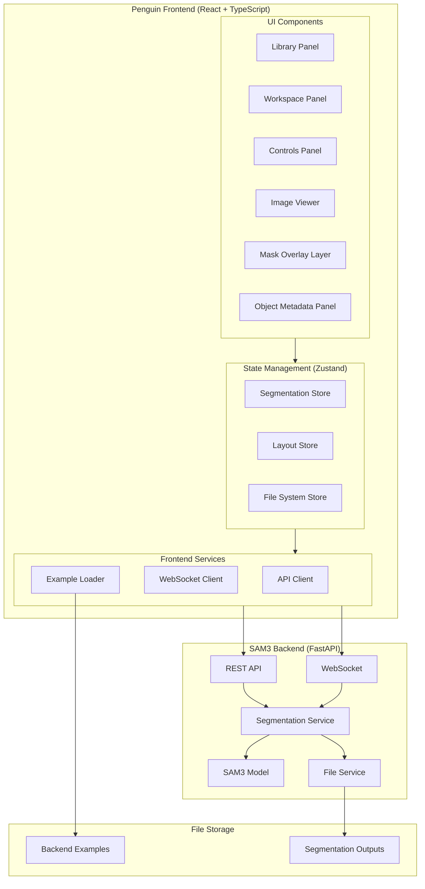
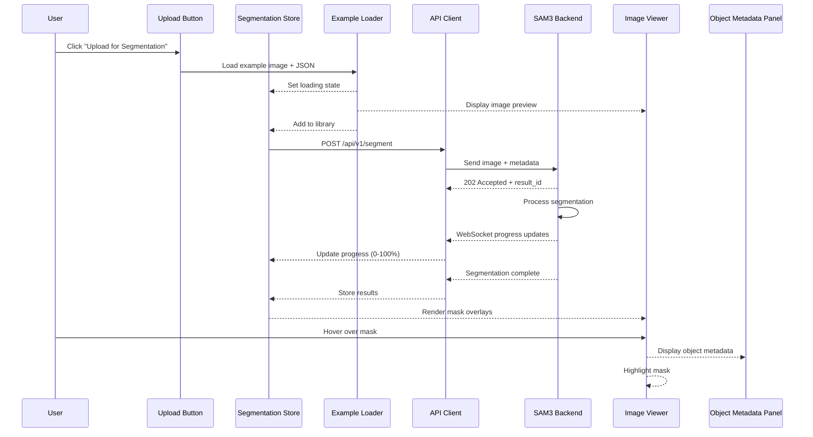

# Design Document

## Overview

The Frontend-Backend Integration connects the Penguin React application with the SAM3 segmentation backend service to provide an end-to-end workflow for image generation simulation, segmentation, and interactive object exploration. The system enables users to load example images through a mockup "Upload for Segmentation" button, automatically process them through SAM3 for object detection, and interact with segmentation results through an enhanced image viewer with mask overlays and metadata panels.

The architecture leverages the existing IDE-like layout with three panels (Library, Workspace, Controls) and extends it with new components for segmentation visualization and interaction. The integration uses both REST API for initial segmentation requests and WebSocket for real-time progress updates, ensuring a responsive user experience during potentially long-running segmentation operations.

## Architecture

### High-Level System Architecture



### Component Interaction Flow



## Components and Interfaces

### 1. Frontend State Management

#### Segmentation Store (`src/store/segmentationStore.ts`)


```typescript
interface MaskData {
  maskId: string;
  label: string;
  confidence: number;
  boundingBox: {
    x1: number;
    y1: number;
    x2: number;
    y2: number;
  };
  areaPixels: number;
  areaPercentage: number;
  centroid: [number, number];
  maskUrl: string;
}

interface SegmentationResult {
  resultId: string;
  originalImageUrl: string;
  masks: MaskData[];
  processingTimeMs: number;
  timestamp: string;
}

interface SegmentationState {
  currentResult: SegmentationResult | null;
  selectedMaskId: string | null;
  hoveredMaskId: string | null;
  isProcessing: boolean;
  progress: number;
  progressMessage: string;
  error: string | null;
  masksVisible: boolean;
  
  uploadForSegmentation: (exampleId: string) => Promise<void>;
  selectMask: (maskId: string | null) => void;
  hoverMask: (maskId: string | null) => void;
  toggleMasksVisibility: () => void;
  clearResults: () => void;
  setProgress: (progress: number, message: string) => void;
}

export const useSegmentationStore = create<SegmentationState>((set, get) => ({
  currentResult: null,
  selectedMaskId: null,
  hoveredMaskId: null,
  isProcessing: false,
  progress: 0,
  progressMessage: '',
  error: null,
  masksVisible: true,
  
  uploadForSegmentation: async (exampleId: string) => {
    set({ isProcessing: true, progress: 0, error: null });
    
    try {
      const { imageBlob, metadataBlob } = await loadExample(exampleId);
      
      set({ progress: 20, progressMessage: 'Uploading to backend...' });
      
      const result = await segmentationAPI.segment(imageBlob, metadataBlob);
      
      set({
        currentResult: result,
        isProcessing: false,
        progress: 100,
        progressMessage: 'Complete',
      });
      
      useFileSystemStore.getState().addToLibrary({
        id: result.resultId,
        name: `example-${exampleId}`,
        url: result.originalImageUrl,
        timestamp: result.timestamp,
      });
      
    } catch (error) {
      set({
        error: error.message,
        isProcessing: false,
        progress: 0,
      });
    }
  },
  
  selectMask: (maskId: string | null) => set({ selectedMaskId: maskId }),
  hoverMask: (maskId: string | null) => set({ hoveredMaskId: maskId }),
  toggleMasksVisibility: () => set((state) => ({ masksVisible: !state.masksVisible })),
  clearResults: () => set({
    currentResult: null,
    selectedMaskId: null,
    hoveredMaskId: null,
    error: null,
  }),
  setProgress: (progress: number, message: string) => set({
    progress,
    progressMessage: message,
  }),
}));
```

### 2. Frontend Services

#### API Client (`src/services/segmentationAPI.ts`)

```typescript
interface SegmentationAPIResponse {
  result_id: string;
  original_image_url: string;
  masks: Array<{
    mask_id: string;
    label: string;
    confidence: number;
    bounding_box: {
      x1: number;
      y1: number;
      x2: number;
      y2: number;
    };
    area_pixels: number;
    area_percentage: number;
    centroid: [number, number];
    mask_url: string;
  }>;
  processing_time_ms: number;
  timestamp: string;
}

class SegmentationAPI {
  private baseUrl: string;
  
  constructor(baseUrl: string = 'http://localhost:8000') {
    this.baseUrl = baseUrl;
  }
  
  async segment(
    imageBlob: Blob,
    metadataBlob?: Blob
  ): Promise<SegmentationResult> {
    const formData = new FormData();
    formData.append('image', imageBlob, 'image.png');
    
    if (metadataBlob) {
      formData.append('metadata', metadataBlob, 'metadata.json');
    }
    
    const response = await fetch(`${this.baseUrl}/api/v1/segment`, {
      method: 'POST',
      body: formData,
    });
    
    if (!response.ok) {
      const error = await response.json();
      throw new Error(error.detail || 'Segmentation failed');
    }
    
    const data: SegmentationAPIResponse = await response.json();
    return this.transformResponse(data);
  }
  
  async getResult(resultId: string): Promise<SegmentationResult> {
    const response = await fetch(`${this.baseUrl}/api/v1/results/${resultId}`);
    
    if (!response.ok) {
      throw new Error('Failed to fetch result');
    }
    
    const data: SegmentationAPIResponse = await response.json();
    return this.transformResponse(data);
  }
  
  private transformResponse(data: SegmentationAPIResponse): SegmentationResult {
    return {
      resultId: data.result_id,
      originalImageUrl: `${this.baseUrl}${data.original_image_url}`,
      masks: data.masks.map(mask => ({
        maskId: mask.mask_id,
        label: mask.label,
        confidence: mask.confidence,
        boundingBox: mask.bounding_box,
        areaPixels: mask.area_pixels,
        areaPercentage: mask.area_percentage,
        centroid: mask.centroid,
        maskUrl: `${this.baseUrl}${mask.mask_url}`,
      })),
      processingTimeMs: data.processing_time_ms,
      timestamp: data.timestamp,
    };
  }
}

export const segmentationAPI = new SegmentationAPI();
```

#### WebSocket Client (`src/services/segmentationWebSocket.ts`)

```typescript
type WebSocketMessageType = 'progress' | 'result' | 'error' | 'connected';

interface WebSocketMessage {
  type: WebSocketMessageType;
  data: any;
  timestamp: string;
}

class SegmentationWebSocket {
  private ws: WebSocket | null = null;
  private reconnectAttempts = 0;
  private maxReconnectAttempts = 5;
  private reconnectDelay = 1000;
  
  connect(
    onProgress: (progress: number, message: string) => void,
    onResult: (result: SegmentationResult) => void,
    onError: (error: string) => void
  ): void {
    if (this.ws?.readyState === WebSocket.OPEN) {
      return;
    }
    
    this.ws = new WebSocket('ws://localhost:8000/ws/segment');
    
    this.ws.onopen = () => {
      console.log('WebSocket connected');
      this.reconnectAttempts = 0;
    };
    
    this.ws.onmessage = (event) => {
      const message: WebSocketMessage = JSON.parse(event.data);
      
      switch (message.type) {
        case 'connected':
          console.log('WebSocket connection acknowledged');
          break;
          
        case 'progress':
          onProgress(message.data.progress, message.data.message);
          break;
          
        case 'result':
          onResult(message.data);
          break;
          
        case 'error':
          onError(message.data.error);
          break;
      }
    };
    
    this.ws.onerror = (error) => {
      console.error('WebSocket error:', error);
      onError('WebSocket connection error');
    };
    
    this.ws.onclose = () => {
      console.log('WebSocket disconnected');
      this.attemptReconnect(onProgress, onResult, onError);
    };
  }
  
  private attemptReconnect(
    onProgress: (progress: number, message: string) => void,
    onResult: (result: SegmentationResult) => void,
    onError: (error: string) => void
  ): void {
    if (this.reconnectAttempts < this.maxReconnectAttempts) {
      this.reconnectAttempts++;
      setTimeout(() => {
        console.log(`Reconnecting... Attempt ${this.reconnectAttempts}`);
        this.connect(onProgress, onResult, onError);
      }, this.reconnectDelay * this.reconnectAttempts);
    }
  }
  
  disconnect(): void {
    if (this.ws) {
      this.ws.close();
      this.ws = null;
    }
  }
  
  sendSegmentationRequest(imageData: string, prompts: string[]): void {
    if (this.ws?.readyState === WebSocket.OPEN) {
      this.ws.send(JSON.stringify({
        action: 'segment',
        image_data: imageData,
        prompts,
      }));
    } else {
      throw new Error('WebSocket not connected');
    }
  }
}

export const segmentationWS = new SegmentationWebSocket();
```

#### Example Loader (`src/services/exampleLoader.ts`)

```typescript
interface ExampleMetadata {
  short_description: string;
  objects: Array<{
    description: string;
    location: string;
    relationship: string;
    relative_size: string;
    shape_and_color: string;
    texture: string;
    appearance_details: string;
    orientation: string;
  }>;
  background_setting: string;
  lighting: {
    conditions: string;
    direction: string;
    shadows: string;
  };
  aesthetics: {
    composition: string;
    color_scheme: string;
    mood_atmosphere: string;
    preference_score: string;
    aesthetic_score: string;
  };
  photographic_characteristics: {
    depth_of_field: string;
    focus: string;
    camera_angle: string;
    lens_focal_length: string;
  };
  style_medium: string;
  context: string;
}

interface LoadedExample {
  imageBlob: Blob;
  metadataBlob: Blob;
  metadata: ExampleMetadata;
}

class ExampleLoader {
  private baseUrl: string;
  
  constructor(baseUrl: string = 'http://localhost:8000') {
    this.baseUrl = baseUrl;
  }
  
  async loadExample(exampleId: string): Promise<LoadedExample> {
    const [imageResponse, metadataResponse] = await Promise.all([
      fetch(`${this.baseUrl}/examples/${exampleId}.png`),
      fetch(`${this.baseUrl}/examples/${exampleId}.json`),
    ]);
    
    if (!imageResponse.ok || !metadataResponse.ok) {
      throw new Error(`Failed to load example ${exampleId}`);
    }
    
    const imageBlob = await imageResponse.blob();
    const metadata: ExampleMetadata = await metadataResponse.json();
    const metadataBlob = new Blob(
      [JSON.stringify(metadata)],
      { type: 'application/json' }
    );
    
    return {
      imageBlob,
      metadataBlob,
      metadata,
    };
  }
  
  async listExamples(): Promise<string[]> {
    return ['01'];
  }
}

export const exampleLoader = new ExampleLoader();
export async function loadExample(exampleId: string): Promise<LoadedExample> {
  return exampleLoader.loadExample(exampleId);
}
```

### 3. UI Components

#### Enhanced Image Viewer with Mask Overlay (`src/components/ImageViewerWithMasks.tsx`)


```typescript
interface ImageViewerWithMasksProps {
  image: string | null;
  isLoading: boolean;
  error: string | null;
}

export const ImageViewerWithMasks: React.FC<ImageViewerWithMasksProps> = ({
  image,
  isLoading,
  error,
}) => {
  const {
    currentResult,
    selectedMaskId,
    hoveredMaskId,
    masksVisible,
    selectMask,
    hoverMask,
  } = useSegmentationStore();
  
  const containerRef = useRef<HTMLDivElement>(null);
  const [imageSize, setImageSize] = useState({ width: 0, height: 0 });
  
  useEffect(() => {
    if (containerRef.current && image) {
      const img = new Image();
      img.onload = () => {
        setImageSize({ width: img.width, height: img.height });
      };
      img.src = image;
    }
  }, [image]);
  
  const handleMaskClick = (maskId: string) => {
    selectMask(selectedMaskId === maskId ? null : maskId);
  };
  
  const handleMaskHover = (maskId: string | null) => {
    hoverMask(maskId);
  };
  
  const handleBackgroundClick = () => {
    selectMask(null);
  };
  
  return (
    <div
      ref={containerRef}
      className="relative w-full aspect-video bg-muted/50 rounded-lg overflow-hidden border border-border"
      onClick={handleBackgroundClick}
    >
      {image && !isLoading && (
        <div className="relative w-full h-full">
          
          
          {masksVisible && currentResult?.masks.map((mask) => (
            <MaskOverlay
              key={mask.maskId}
              mask={mask}
              isSelected={selectedMaskId === mask.maskId}
              isHovered={hoveredMaskId === mask.maskId}
              imageSize={imageSize}
              onClick={(e) => {
                e.stopPropagation();
                handleMaskClick(mask.maskId);
              }}
              onMouseEnter={() => handleMaskHover(mask.maskId)}
              onMouseLeave={() => handleMaskHover(null)}
            />
          ))}
        </div>
      )}
      
      {isLoading && <LoadingOverlay />}
      {error && <ErrorOverlay error={error} />}
      {!image && !isLoading && !error && <EmptyState />}
    </div>
  );
};
```

#### Mask Overlay Component (`src/components/MaskOverlay.tsx`)

```typescript
interface MaskOverlayProps {
  mask: MaskData;
  isSelected: boolean;
  isHovered: boolean;
  imageSize: { width: number; height: number };
  onClick: (e: React.MouseEvent) => void;
  onMouseEnter: () => void;
  onMouseLeave: () => void;
}

export const MaskOverlay: React.FC<MaskOverlayProps> = ({
  mask,
  isSelected,
  isHovered,
  imageSize,
  onClick,
  onMouseEnter,
  onMouseLeave,
}) => {
  const opacity = isSelected ? 0.7 : isHovered ? 0.6 : 0.4;
  const borderColor = isSelected ? 'border-blue-500' : 'border-transparent';
  
  const style: React.CSSProperties = {
    position: 'absolute',
    left: `${(mask.boundingBox.x1 / imageSize.width) * 100}%`,
    top: `${(mask.boundingBox.y1 / imageSize.height) * 100}%`,
    width: `${((mask.boundingBox.x2 - mask.boundingBox.x1) / imageSize.width) * 100}%`,
    height: `${((mask.boundingBox.y2 - mask.boundingBox.y1) / imageSize.height) * 100}%`,
    opacity,
    transition: 'opacity 150ms ease, border-color 200ms ease',
    cursor: 'pointer',
  };
  
  return (
    <div
      style={style}
      className={`border-2 ${borderColor}`}
      onClick={onClick}
      onMouseEnter={onMouseEnter}
      onMouseLeave={onMouseLeave}
    >
      
      
      {isHovered && (
        <div
          className="absolute bg-black/80 text-white text-xs px-2 py-1 rounded pointer-events-none"
          style={{
            left: '50%',
            top: '-30px',
            transform: 'translateX(-50%)',
            whiteSpace: 'nowrap',
          }}
        >
          {mask.label} ({(mask.confidence * 100).toFixed(1)}%)
        </div>
      )}
    </div>
  );
};
```

#### Object Metadata Panel (`src/components/ObjectMetadataPanel.tsx`)

```typescript
export const ObjectMetadataPanel: React.FC = () => {
  const { currentResult, selectedMaskId, hoveredMaskId } = useSegmentationStore();
  const [activeTab, setActiveTab] = useState<'object' | 'lighting' | 'camera'>('object');
  
  const activeMaskId = selectedMaskId || hoveredMaskId;
  const activeMask = currentResult?.masks.find(m => m.maskId === activeMaskId);
  
  if (!activeMask) {
    return (
      <div className="p-4 text-center text-muted-foreground">
        <p className="text-sm">Hover over an object to see details</p>
      </div>
    );
  }
  
  return (
    <div className="flex flex-col h-full">
      <Tabs value={activeTab} onValueChange={(v) => setActiveTab(v as any)}>
        <TabsList className="w-full">
          <TabsTrigger value="object" className="flex-1">Object</TabsTrigger>
          <TabsTrigger value="lighting" className="flex-1">Lighting</TabsTrigger>
          <TabsTrigger value="camera" className="flex-1">Camera</TabsTrigger>
        </TabsList>
        
        <TabsContent value="object" className="flex-1 overflow-y-auto p-4">
          <ObjectDetailsTab mask={activeMask} />
        </TabsContent>
        
        <TabsContent value="lighting" className="flex-1 overflow-y-auto p-4">
          <LightingDetailsTab />
        </TabsContent>
        
        <TabsContent value="camera" className="flex-1 overflow-y-auto p-4">
          <CameraDetailsTab />
        </TabsContent>
      </Tabs>
    </div>
  );
};

const ObjectDetailsTab: React.FC<{ mask: MaskData }> = ({ mask }) => (
  <div className="space-y-3">
    <div>
      <h3 className="text-sm font-semibold mb-1">Label</h3>
      <p className="text-sm text-muted-foreground">{mask.label}</p>
    </div>
    
    <div>
      <h3 className="text-sm font-semibold mb-1">Confidence</h3>
      <div className="flex items-center gap-2">
        <div className="flex-1 h-2 bg-muted rounded-full overflow-hidden">
          <div
            className="h-full bg-primary"
            style={{ width: `${mask.confidence * 100}%` }}
          />
        </div>
        <span className="text-sm">{(mask.confidence * 100).toFixed(1)}%</span>
      </div>
    </div>
    
    <div>
      <h3 className="text-sm font-semibold mb-1">Bounding Box</h3>
      <div className="grid grid-cols-2 gap-2 text-xs">
        <div>X1: {mask.boundingBox.x1.toFixed(0)}</div>
        <div>Y1: {mask.boundingBox.y1.toFixed(0)}</div>
        <div>X2: {mask.boundingBox.x2.toFixed(0)}</div>
        <div>Y2: {mask.boundingBox.y2.toFixed(0)}</div>
      </div>
    </div>
    
    <div>
      <h3 className="text-sm font-semibold mb-1">Area</h3>
      <p className="text-sm text-muted-foreground">
        {mask.areaPixels.toLocaleString()} pixels ({mask.areaPercentage.toFixed(2)}%)
      </p>
    </div>
    
    <div>
      <h3 className="text-sm font-semibold mb-1">Centroid</h3>
      <p className="text-sm text-muted-foreground">
        ({mask.centroid[0]}, {mask.centroid[1]})
      </p>
    </div>
  </div>
);

const LightingDetailsTab: React.FC = () => {
  const metadata = useSegmentationStore(state => state.currentResult?.metadata);
  
  if (!metadata?.lighting) {
    return <p className="text-sm text-muted-foreground">No lighting information available</p>;
  }
  
  return (
    <div className="space-y-3">
      <div>
        <h3 className="text-sm font-semibold mb-1">Conditions</h3>
        <p className="text-sm text-muted-foreground">{metadata.lighting.conditions}</p>
      </div>
      <div>
        <h3 className="text-sm font-semibold mb-1">Direction</h3>
        <p className="text-sm text-muted-foreground">{metadata.lighting.direction}</p>
      </div>
      <div>
        <h3 className="text-sm font-semibold mb-1">Shadows</h3>
        <p className="text-sm text-muted-foreground">{metadata.lighting.shadows}</p>
      </div>
    </div>
  );
};

const CameraDetailsTab: React.FC = () => {
  const metadata = useSegmentationStore(state => state.currentResult?.metadata);
  
  if (!metadata?.photographic_characteristics) {
    return <p className="text-sm text-muted-foreground">No camera information available</p>;
  }
  
  const camera = metadata.photographic_characteristics;
  
  return (
    <div className="space-y-3">
      <div>
        <h3 className="text-sm font-semibold mb-1">Angle</h3>
        <p className="text-sm text-muted-foreground">{camera.camera_angle}</p>
      </div>
      <div>
        <h3 className="text-sm font-semibold mb-1">Focal Length</h3>
        <p className="text-sm text-muted-foreground">{camera.lens_focal_length}</p>
      </div>
      <div>
        <h3 className="text-sm font-semibold mb-1">Depth of Field</h3>
        <p className="text-sm text-muted-foreground">{camera.depth_of_field}</p>
      </div>
      <div>
        <h3 className="text-sm font-semibold mb-1">Focus</h3>
        <p className="text-sm text-muted-foreground">{camera.focus}</p>
      </div>
    </div>
  );
};
```

#### Upload for Segmentation Button (`src/components/UploadForSegmentationButton.tsx`)

```typescript
export const UploadForSegmentationButton: React.FC = () => {
  const { uploadForSegmentation, isProcessing, progress, progressMessage } = useSegmentationStore();
  const [selectedExample, setSelectedExample] = useState('01');
  
  const handleUpload = async () => {
    await uploadForSegmentation(selectedExample);
  };
  
  return (
    <div className="space-y-3">
      <div>
        <label className="text-sm font-medium mb-2 block">Example Image</label>
        <select
          value={selectedExample}
          onChange={(e) => setSelectedExample(e.target.value)}
          className="w-full px-3 py-2 border rounded-md"
          disabled={isProcessing}
        >
          <option value="01">Example 01 - Ring</option>
        </select>
      </div>
      
      <Button
        onClick={handleUpload}
        disabled={isProcessing}
        className="w-full"
      >
        {isProcessing ? (
          <div className="flex items-center gap-2">
            <LoadingSpinner size="sm" />
            <span>{progressMessage || 'Processing...'}</span>
          </div>
        ) : (
          'Upload for Segmentation'
        )}
      </Button>
      
      {isProcessing && (
        <div className="space-y-1">
          <div className="w-full h-2 bg-muted rounded-full overflow-hidden">
            <div
              className="h-full bg-primary transition-all duration-300"
              style={{ width: `${progress}%` }}
            />
          </div>
          <p className="text-xs text-muted-foreground text-center">
            {progress}% - {progressMessage}
          </p>
        </div>
      )}
    </div>
  );
};
```

### 4. Updated Controls Panel Integration

#### Enhanced Controls Panel (`src/components/ControlsPanel.tsx`)


```typescript
export const ControlsPanel: React.FC = () => {
  const { activeControlsTab, setActiveControlsTab } = useLayoutStore();

  return (
    <aside className="flex h-full flex-col" aria-label="controls panel">
      <PanelHeader title="Edit" position="right" />

      <Tabs
        value={activeControlsTab}
        onValueChange={(value) => setActiveControlsTab(value as 'image' | 'generation' | 'metadata')}
        className="flex-1 flex flex-col overflow-hidden"
      >
        <TabsList className="w-full rounded-none border-b border-border bg-muted/50">
          <TabsTrigger value="image" className="flex-1 text-sm">
            Image
          </TabsTrigger>
          <TabsTrigger value="generation" className="flex-1 text-sm">
            Description
          </TabsTrigger>
          <TabsTrigger value="metadata" className="flex-1 text-sm">
            Objects
          </TabsTrigger>
        </TabsList>

        <TabsContent value="image" className="flex-1 overflow-y-auto p-4 mt-0">
          <ImageControlsTab />
        </TabsContent>

        <TabsContent value="generation" className="flex-1 overflow-y-auto p-4 mt-0">
          <GenerationControlsTab />
          <div className="mt-6 pt-6 border-t">
            <UploadForSegmentationButton />
          </div>
        </TabsContent>

        <TabsContent value="metadata" className="flex-1 overflow-y-auto mt-0">
          <ObjectMetadataPanel />
        </TabsContent>
      </Tabs>
    </aside>
  );
};
```

## Data Models

### Frontend Type Definitions

```typescript
interface MaskData {
  maskId: string;
  label: string;
  confidence: number;
  boundingBox: BoundingBox;
  areaPixels: number;
  areaPercentage: number;
  centroid: [number, number];
  maskUrl: string;
}

interface BoundingBox {
  x1: number;
  y1: number;
  x2: number;
  y2: number;
}

interface SegmentationResult {
  resultId: string;
  originalImageUrl: string;
  masks: MaskData[];
  processingTimeMs: number;
  timestamp: string;
  metadata?: ExampleMetadata;
}

interface ExampleMetadata {
  short_description: string;
  objects: ObjectDescription[];
  background_setting: string;
  lighting: LightingInfo;
  aesthetics: AestheticsInfo;
  photographic_characteristics: CameraInfo;
  style_medium: string;
  context: string;
}

interface ObjectDescription {
  description: string;
  location: string;
  relationship: string;
  relative_size: string;
  shape_and_color: string;
  texture: string;
  appearance_details: string;
  orientation: string;
}

interface LightingInfo {
  conditions: string;
  direction: string;
  shadows: string;
}

interface CameraInfo {
  depth_of_field: string;
  focus: string;
  camera_angle: string;
  lens_focal_length: string;
}

interface AestheticsInfo {
  composition: string;
  color_scheme: string;
  mood_atmosphere: string;
  preference_score: string;
  aesthetic_score: string;
}
```

### Backend API Contracts

The backend already provides the necessary endpoints:

**POST /api/v1/segment**
- Request: multipart/form-data with `image` and optional `metadata`
- Response: SegmentationResponse with masks, bounding boxes, and URLs

**GET /api/v1/results/{result_id}**
- Response: Previously computed SegmentationResponse

**WebSocket /ws/segment**
- Messages: progress updates, results, errors

**Static Files /outputs/{result_id}/**
- Serves original images and mask PNGs

**Static Files /examples/**
- Serves example images and JSON metadata (needs to be added)

## Error Handling

### Frontend Error Handling Strategy

```typescript
class SegmentationError extends Error {
  constructor(
    message: string,
    public code: string,
    public details?: any
  ) {
    super(message);
    this.name = 'SegmentationError';
  }
}

const handleSegmentationError = (error: unknown): string => {
  if (error instanceof SegmentationError) {
    switch (error.code) {
      case 'NETWORK_ERROR':
        return 'Unable to connect to segmentation service. Please check your connection.';
      case 'INVALID_IMAGE':
        return 'Invalid image format. Please use PNG or JPEG.';
      case 'BACKEND_ERROR':
        return 'Segmentation failed. Please try again.';
      case 'TIMEOUT':
        return 'Segmentation timed out. Please try a smaller image.';
      default:
        return error.message;
    }
  }
  
  if (error instanceof Error) {
    return error.message;
  }
  
  return 'An unexpected error occurred';
};
```

### Error Display Components

```typescript
const ErrorOverlay: React.FC<{ error: string }> = ({ error }) => (
  <div className="absolute inset-0 flex items-center justify-center bg-destructive/10 p-6">
    <div className="text-center text-destructive max-w-md">
      <AlertCircle className="h-12 w-12 mx-auto mb-3" />
      <p className="text-base font-semibold">Segmentation Failed</p>
      <p className="text-sm mt-2">{error}</p>
      <Button
        variant="outline"
        size="sm"
        className="mt-4"
        onClick={() => useSegmentationStore.getState().clearResults()}
      >
        Try Again
      </Button>
    </div>
  </div>
);
```

## Testing Strategy

### Unit Tests

**Segmentation Store Tests** (`src/store/__tests__/segmentationStore.test.ts`)
- Test state initialization
- Test uploadForSegmentation action
- Test mask selection and hover
- Test error handling
- Test progress updates

**API Client Tests** (`src/services/__tests__/segmentationAPI.test.ts`)
- Mock fetch responses
- Test successful segmentation
- Test error responses
- Test response transformation

**Component Tests**
- MaskOverlay rendering and interactions
- ObjectMetadataPanel tab switching
- UploadForSegmentationButton states

### Integration Tests

**End-to-End Segmentation Flow** (`src/__tests__/integration/segmentation.test.tsx`)
- Load example image
- Trigger segmentation
- Verify mask overlays render
- Test hover interactions
- Test metadata panel updates

### Mock Data

```typescript
export const mockSegmentationResult: SegmentationResult = {
  resultId: 'test-result-123',
  originalImageUrl: 'http://localhost:8000/outputs/test-result-123/original.png',
  masks: [
    {
      maskId: 'mask_0',
      label: 'ring band',
      confidence: 0.95,
      boundingBox: { x1: 100, y1: 150, x2: 300, y2: 350 },
      areaPixels: 15000,
      areaPercentage: 5.2,
      centroid: [200, 250],
      maskUrl: 'http://localhost:8000/outputs/test-result-123/mask_0.png',
    },
    {
      maskId: 'mask_1',
      label: 'red gemstone',
      confidence: 0.92,
      boundingBox: { x1: 180, y1: 120, x2: 220, y2: 180 },
      areaPixels: 2400,
      areaPercentage: 0.8,
      centroid: [200, 150],
      maskUrl: 'http://localhost:8000/outputs/test-result-123/mask_1.png',
    },
  ],
  processingTimeMs: 1250,
  timestamp: '2025-11-21T10:30:00Z',
};
```

## Backend Enhancements

### Serve Example Files

The backend needs to serve example files as static content:

```python
app.mount("/examples", StaticFiles(directory="examples"), name="examples")
```

This allows the frontend to fetch example images and JSON via:
- `GET /examples/01.png`
- `GET /examples/01.json`

### CORS Configuration

Ensure CORS allows the frontend origin:

```python
app.add_middleware(
    CORSMiddleware,
    allow_origins=["http://localhost:5173"],
    allow_credentials=True,
    allow_methods=["*"],
    allow_headers=["*"],
)
```

## Performance Optimization

### Image Loading Optimization

```typescript
const useOptimizedImage = (src: string) => {
  const [loaded, setLoaded] = useState(false);
  const [error, setError] = useState(false);
  
  useEffect(() => {
    const img = new Image();
    img.onload = () => setLoaded(true);
    img.onerror = () => setError(true);
    img.src = src;
  }, [src]);
  
  return { loaded, error };
};
```

### Mask Rendering Optimization

- Use CSS transforms for positioning instead of recalculating on every render
- Memoize mask components to prevent unnecessary re-renders
- Use `will-change` CSS property for animated masks
- Lazy load mask images with Intersection Observer

### WebSocket Connection Management

- Implement connection pooling
- Automatic reconnection with exponential backoff
- Heartbeat mechanism to detect stale connections
- Clean up connections on component unmount

## Keyboard Shortcuts

### Implementation

```typescript
const useKeyboardShortcuts = () => {
  const { selectMask, toggleMasksVisibility, currentResult } = useSegmentationStore();
  
  useEffect(() => {
    const handleKeyDown = (e: KeyboardEvent) => {
      if (!currentResult) return;
      
      switch (e.key) {
        case 'Tab':
          e.preventDefault();
          const currentIndex = currentResult.masks.findIndex(
            m => m.maskId === selectedMaskId
          );
          const nextIndex = e.shiftKey
            ? (currentIndex - 1 + currentResult.masks.length) % currentResult.masks.length
            : (currentIndex + 1) % currentResult.masks.length;
          selectMask(currentResult.masks[nextIndex].maskId);
          break;
          
        case 'Escape':
          selectMask(null);
          break;
          
        case 'm':
        case 'M':
          toggleMasksVisibility();
          break;
      }
    };
    
    window.addEventListener('keydown', handleKeyDown);
    return () => window.removeEventListener('keydown', handleKeyDown);
  }, [currentResult, selectMask, toggleMasksVisibility]);
};
```

## Accessibility

### ARIA Labels and Roles

```typescript
<div
  role="img"
  aria-label={`Segmentation mask for ${mask.label}`}
  aria-selected={isSelected}
  tabIndex={0}
  onKeyDown={(e) => {
    if (e.key === 'Enter' || e.key === ' ') {
      onClick(e as any);
    }
  }}
>
  {/* Mask content */}
</div>
```

### Screen Reader Support

- Announce mask selection changes
- Provide text alternatives for visual information
- Ensure keyboard navigation works for all interactions
- Use semantic HTML elements

## Deployment Considerations

### Environment Configuration

```typescript
const config = {
  apiBaseUrl: import.meta.env.VITE_API_BASE_URL || 'http://localhost:8000',
  wsBaseUrl: import.meta.env.VITE_WS_BASE_URL || 'ws://localhost:8000',
  enableWebSocket: import.meta.env.VITE_ENABLE_WS !== 'false',
};
```

### Production Optimizations

- Enable code splitting for segmentation components
- Lazy load mask overlay components
- Use CDN for static assets
- Implement service worker for offline support
- Add request caching for repeated segmentation results

### Monitoring

```typescript
const trackSegmentation = (result: SegmentationResult) => {
  analytics.track('segmentation_complete', {
    result_id: result.resultId,
    num_masks: result.masks.length,
    processing_time_ms: result.processingTimeMs,
  });
};

const trackError = (error: SegmentationError) => {
  analytics.track('segmentation_error', {
    error_code: error.code,
    error_message: error.message,
  });
};
```
