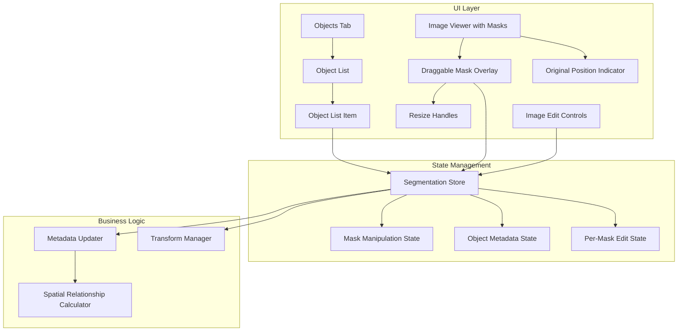
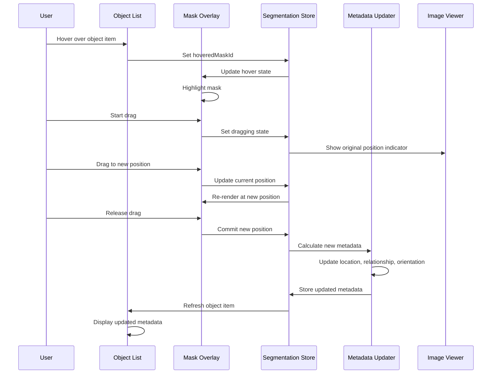

# Design Document

## Overview

The Interactive Object Manipulation system transforms the Penguin application's Objects tab from a simple metadata viewer into a comprehensive object inspector and manipulation interface. This design enables users to view detailed JSON information for each detected object, understand which prompt tier was used for segmentation, manipulate object positions and scales through direct interaction with mask overlays, and have metadata automatically update to reflect visual transformations.

The system provides bidirectional synchronization between mask overlays in the Image Viewer and object list items in the Objects tab. When users hover over a mask, the corresponding list item scrolls into view and highlights; conversely, hovering over a list item highlights the corresponding mask. This creates an intuitive connection between the visual representation and the data representation of each object.

The manipulation capabilities include drag-and-drop repositioning with visual indicators showing original positions, corner-based scaling with aspect ratio preservation, and per-mask image edit controls. All transformations trigger automatic metadata updates, ensuring that location, relationship, size, and appearance fields stay synchronized with the visual state.

## Architecture

### High-Level Component Architecture




### Interaction Flow



## Components and Interfaces

### 1. Enhanced Segmentation Store

The segmentation store is extended to manage mask manipulation state, per-mask transformations, and metadata updates.

```typescript
interface MaskTransform {
  position: { x: number; y: number };
  scale: { width: number; height: number };
  imageEdits: {
    brightness: number;
    contrast: number;
    saturation: number;
    hue: number;
    blur: number;
    exposure: number;
    vibrance: number;
  };
}

interface MaskManipulationState {
  maskId: string;
  originalBoundingBox: BoundingBox;
  currentBoundingBox: BoundingBox;
  transform: MaskTransform;
  isDragging: boolean;
  isResizing: boolean;
  isHidden: boolean;
}

interface EnhancedMaskMetadata extends MaskMetadata {
  promptTier: 'CORE' | 'CORE_VISUAL' | 'CORE_VISUAL_SPATIAL';
  promptText: string;
  objectMetadata?: {
    description: string;
    location: string;
    relationship: string;
    relative_size: string;
    shape_and_color: string;
    texture: string;
    appearance_details: string;
    orientation: string;
  };
}
```


```typescript
interface SegmentationState {
  // ... existing state ...
  
  // Mask manipulation state
  maskManipulation: Map<string, MaskManipulationState>;
  
  // Actions for mask manipulation
  startDragMask: (maskId: string) => void;
  updateMaskPosition: (maskId: string, x: number, y: number) => void;
  endDragMask: (maskId: string) => void;
  
  startResizeMask: (maskId: string, handle: 'nw' | 'ne' | 'sw' | 'se') => void;
  updateMaskSize: (maskId: string, width: number, height: number) => void;
  endResizeMask: (maskId: string) => void;
  
  resetMaskTransform: (maskId: string) => void;
  hideMask: (maskId: string) => void;
  showMask: (maskId: string) => void;
  
  applyImageEditToMask: (maskId: string, edit: Partial<MaskTransform['imageEdits']>) => void;
  
  // Metadata update actions
  updateMaskMetadata: (maskId: string, metadata: Partial<EnhancedMaskMetadata['objectMetadata']>) => void;
}
```

### 2. Objects Tab Component

The Objects tab displays a scrollable list of all detected objects with expandable details.

```typescript
interface ObjectsTabProps {
  // No props needed - reads from store
}

export const ObjectsTab: React.FC<ObjectsTabProps> = () => {
  const { results, selectedMaskId, hoveredMaskId, hoverMask, selectMask } = useSegmentationStore();
  const listRef = useRef<HTMLDivElement>(null);
  
  // Scroll to hovered item
  useEffect(() => {
    if (hoveredMaskId && listRef.current) {
      const itemElement = listRef.current.querySelector(`[data-mask-id="${hoveredMaskId}"]`);
      if (itemElement) {
        itemElement.scrollIntoView({ behavior: 'smooth', block: 'nearest' });
      }
    }
  }, [hoveredMaskId]);
  
  if (!results || results.masks.length === 0) {
    return (
      <div className="p-4 text-center text-muted-foreground">
        <p className="text-sm">No objects detected. Upload an image for segmentation.</p>
      </div>
    );
  }
  
  // Sort by confidence descending
  const sortedMasks = [...results.masks].sort((a, b) => b.confidence - a.confidence);
  
  return (
    <div ref={listRef} className="flex flex-col h-full overflow-y-auto">
      {sortedMasks.map((mask) => (
        <ObjectListItem
          key={mask.mask_id}
          mask={mask}
          isSelected={selectedMaskId === mask.mask_id}
          isHovered={hoveredMaskId === mask.mask_id}
          onHover={() => hoverMask(mask.mask_id)}
          onHoverEnd={() => hoverMask(null)}
          onClick={() => selectMask(mask.mask_id)}
        />
      ))}
    </div>
  );
};
```


### 3. Object List Item Component

Each object list item displays comprehensive information about a detected object.

```typescript
interface ObjectListItemProps {
  mask: EnhancedMaskMetadata;
  isSelected: boolean;
  isHovered: boolean;
  onHover: () => void;
  onHoverEnd: () => void;
  onClick: () => void;
}

export const ObjectListItem: React.FC<ObjectListItemProps> = ({
  mask,
  isSelected,
  isHovered,
  onHover,
  onHoverEnd,
  onClick,
}) => {
  const [isExpanded, setIsExpanded] = useState(false);
  const { maskManipulation, resetMaskTransform } = useSegmentationStore();
  
  const manipState = maskManipulation.get(mask.mask_id);
  const hasMoved = manipState && !areBoundingBoxesEqual(
    manipState.originalBoundingBox,
    manipState.currentBoundingBox
  );
  
  // Auto-expand when hovered
  useEffect(() => {
    if (isHovered) {
      setIsExpanded(true);
    }
  }, [isHovered]);
  
  const borderColor = getMaskColor(mask.mask_id);
  
  return (
    <div
      data-mask-id={mask.mask_id}
      className={cn(
        "border-l-4 p-3 transition-colors duration-150",
        isHovered && "bg-accent",
        isSelected && "bg-accent/50"
      )}
      style={{ borderLeftColor: borderColor }}
      onMouseEnter={onHover}
      onMouseLeave={onHoverEnd}
      onClick={onClick}
    >
      <div className="flex items-start justify-between">
        <div className="flex-1">
          <div className="flex items-center gap-2">
            <h4 className="font-semibold text-sm">{mask.label}</h4>
            {isSelected && <CheckCircle className="h-4 w-4 text-primary" />}
          </div>
          
          <div className="flex items-center gap-2 mt-1">
            <div className="flex-1 h-2 bg-muted rounded-full overflow-hidden">
              <div
                className="h-full bg-primary"
                style={{ width: `${mask.confidence * 100}%` }}
              />
            </div>
            <span className="text-xs text-muted-foreground">
              {(mask.confidence * 100).toFixed(1)}%
            </span>
          </div>
        </div>
        
        
      </div>
      
      <button
        onClick={(e) => {
          e.stopPropagation();
          setIsExpanded(!isExpanded);
        }}
        className="text-xs text-muted-foreground mt-2 hover:text-foreground"
      >
        {isExpanded ? 'Show less' : 'Show more'}
      </button>
      
      {isExpanded && (
        <div className="mt-3 space-y-3 text-sm animate-in fade-in duration-100">
          <PromptSection mask={mask} />
          <MetadataSection mask={mask} />
          <BoundingBoxSection mask={mask} />
          
          {hasMoved && (
            <Button
              size="sm"
              variant="outline"
              onClick={(e) => {
                e.stopPropagation();
                resetMaskTransform(mask.mask_id);
              }}
              className="w-full"
            >
              Reset Position
            </Button>
          )}
        </div>
      )}
    </div>
  );
};
```


### 4. Prompt Section Component

Displays the prompt tier and exact text used for segmentation.

```typescript
const PromptSection: React.FC<{ mask: EnhancedMaskMetadata }> = ({ mask }) => (
  <div className="space-y-2">
    <div>
      <h5 className="text-xs font-semibold text-muted-foreground mb-1">Prompt Tier</h5>
      <Badge variant={getPromptTierVariant(mask.promptTier)}>
        {mask.promptTier}
      </Badge>
    </div>
    
    <div>
      <h5 className="text-xs font-semibold text-muted-foreground mb-1">Prompt Text</h5>
      <p className="text-xs bg-muted p-2 rounded font-mono">{mask.promptText}</p>
    </div>
  </div>
);

const getPromptTierVariant = (tier: string): 'default' | 'secondary' | 'outline' => {
  switch (tier) {
    case 'CORE':
      return 'default';
    case 'CORE_VISUAL':
      return 'secondary';
    case 'CORE_VISUAL_SPATIAL':
      return 'outline';
    default:
      return 'default';
  }
};
```

### 5. Metadata Section Component

Displays all JSON metadata fields for the object.

```typescript
const MetadataSection: React.FC<{ mask: EnhancedMaskMetadata }> = ({ mask }) => {
  if (!mask.objectMetadata) {
    return null;
  }
  
  const metadata = mask.objectMetadata;
  const fields = [
    { key: 'description', label: 'Description', value: metadata.description },
    { key: 'location', label: 'Location', value: metadata.location },
    { key: 'relationship', label: 'Relationship', value: metadata.relationship },
    { key: 'relative_size', label: 'Relative Size', value: metadata.relative_size },
    { key: 'shape_and_color', label: 'Shape & Color', value: metadata.shape_and_color },
    { key: 'texture', label: 'Texture', value: metadata.texture },
    { key: 'appearance_details', label: 'Appearance', value: metadata.appearance_details },
    { key: 'orientation', label: 'Orientation', value: metadata.orientation },
  ].filter(field => field.value); // Filter out empty fields
  
  return (
    <div className="space-y-2">
      <h5 className="text-xs font-semibold text-muted-foreground">Object Metadata</h5>
      {fields.map(field => (
        <div key={field.key}>
          <span className="text-xs font-medium">{field.label}:</span>
          <p className="text-xs text-muted-foreground mt-0.5">{field.value}</p>
        </div>
      ))}
    </div>
  );
};
```

### 6. Bounding Box Section Component

Displays spatial information about the object.

```typescript
const BoundingBoxSection: React.FC<{ mask: EnhancedMaskMetadata }> = ({ mask }) => {
  const { maskManipulation } = useSegmentationStore();
  const manipState = maskManipulation.get(mask.mask_id);
  const bbox = manipState?.currentBoundingBox || mask.bounding_box;
  
  return (
    <div className="space-y-2">
      <h5 className="text-xs font-semibold text-muted-foreground">Spatial Information</h5>
      
      <div className="grid grid-cols-2 gap-2 text-xs">
        <div>
          <span className="font-medium">X1:</span> {Math.round(bbox.x1)}
        </div>
        <div>
          <span className="font-medium">Y1:</span> {Math.round(bbox.y1)}
        </div>
        <div>
          <span className="font-medium">X2:</span> {Math.round(bbox.x2)}
        </div>
        <div>
          <span className="font-medium">Y2:</span> {Math.round(bbox.y2)}
        </div>
      </div>
      
      <div className="text-xs">
        <span className="font-medium">Centroid:</span> ({Math.round(mask.centroid[0])}, {Math.round(mask.centroid[1])})
      </div>
      
      <div className="text-xs">
        <span className="font-medium">Area:</span> {mask.area_pixels.toLocaleString()} px ({mask.area_percentage.toFixed(2)}%)
      </div>
    </div>
  );
};
```


### 7. Draggable Mask Overlay Component

Enhanced mask overlay with drag, resize, and per-mask edit capabilities.

```typescript
interface DraggableMaskOverlayProps {
  mask: EnhancedMaskMetadata;
  isSelected: boolean;
  isHovered: boolean;
  imageSize: { width: number; height: number };
  onClick: (e: React.MouseEvent) => void;
  onMouseEnter: () => void;
  onMouseLeave: () => void;
}

export const DraggableMaskOverlay: React.FC<DraggableMaskOverlayProps> = ({
  mask,
  isSelected,
  isHovered,
  imageSize,
  onClick,
  onMouseEnter,
  onMouseLeave,
}) => {
  const {
    maskManipulation,
    startDragMask,
    updateMaskPosition,
    endDragMask,
    startResizeMask,
    updateMaskSize,
    endResizeMask,
  } = useSegmentationStore();
  
  const manipState = maskManipulation.get(mask.mask_id);
  const bbox = manipState?.currentBoundingBox || mask.bounding_box;
  const transform = manipState?.transform;
  
  const [dragStart, setDragStart] = useState<{ x: number; y: number } | null>(null);
  const [resizeHandle, setResizeHandle] = useState<'nw' | 'ne' | 'sw' | 'se' | null>(null);
  
  const handleMouseDown = (e: React.MouseEvent) => {
    if (!isSelected) {
      onClick(e);
      return;
    }
    
    e.stopPropagation();
    setDragStart({ x: e.clientX, y: e.clientY });
    startDragMask(mask.mask_id);
  };
  
  useEffect(() => {
    if (!dragStart) return;
    
    const handleMouseMove = (e: MouseEvent) => {
      const dx = e.clientX - dragStart.x;
      const dy = e.clientY - dragStart.y;
      
      // Convert pixel delta to image coordinates
      const imageX = (dx / imageSize.width) * 100;
      const imageY = (dy / imageSize.height) * 100;
      
      updateMaskPosition(mask.mask_id, bbox.x1 + imageX, bbox.y1 + imageY);
    };
    
    const handleMouseUp = () => {
      setDragStart(null);
      endDragMask(mask.mask_id);
    };
    
    window.addEventListener('mousemove', handleMouseMove);
    window.addEventListener('mouseup', handleMouseUp);
    
    return () => {
      window.removeEventListener('mousemove', handleMouseMove);
      window.removeEventListener('mouseup', handleMouseUp);
    };
  }, [dragStart, bbox, imageSize, mask.mask_id, updateMaskPosition, endDragMask]);
  
  const opacity = manipState?.isDragging ? 0.5 : isSelected ? 0.7 : isHovered ? 0.6 : 0.4;
  const borderColor = isSelected ? 'border-blue-500' : 'border-transparent';
  const cursor = manipState?.isDragging ? 'grabbing' : isSelected ? 'grab' : 'pointer';
  
  const style: React.CSSProperties = {
    position: 'absolute',
    left: `${(bbox.x1 / imageSize.width) * 100}%`,
    top: `${(bbox.y1 / imageSize.height) * 100}%`,
    width: `${((bbox.x2 - bbox.x1) / imageSize.width) * 100}%`,
    height: `${((bbox.y2 - bbox.y1) / imageSize.height) * 100}%`,
    opacity,
    transition: manipState?.isDragging ? 'none' : 'opacity 150ms ease, border-color 200ms ease',
    cursor,
    filter: transform ? combineImageEditFilters(transform.imageEdits) : undefined,
  };
  
  return (
    <>
      <div
        style={style}
        className={`border-2 ${borderColor}`}
        onMouseDown={handleMouseDown}
        onMouseEnter={onMouseEnter}
        onMouseLeave={onMouseLeave}
      >
        
        
        {isSelected && <ResizeHandles maskId={mask.mask_id} />}
      </div>
      
      {manipState && !areBoundingBoxesEqual(manipState.originalBoundingBox, bbox) && (
        <OriginalPositionIndicator
          bbox={manipState.originalBoundingBox}
          imageSize={imageSize}
        />
      )}
    </>
  );
};
```


### 8. Resize Handles Component

Provides corner handles for scaling masks.

```typescript
interface ResizeHandlesProps {
  maskId: string;
}

export const ResizeHandles: React.FC<ResizeHandlesProps> = ({ maskId }) => {
  const { startResizeMask, updateMaskSize, endResizeMask } = useSegmentationStore();
  
  const handles: Array<{ position: 'nw' | 'ne' | 'sw' | 'se'; style: React.CSSProperties }> = [
    { position: 'nw', style: { top: -4, left: -4, cursor: 'nw-resize' } },
    { position: 'ne', style: { top: -4, right: -4, cursor: 'ne-resize' } },
    { position: 'sw', style: { bottom: -4, left: -4, cursor: 'sw-resize' } },
    { position: 'se', style: { bottom: -4, right: -4, cursor: 'se-resize' } },
  ];
  
  return (
    <>
      {handles.map(({ position, style }) => (
        <div
          key={position}
          className="absolute w-3 h-3 bg-blue-500 border-2 border-white rounded-full"
          style={style}
          onMouseDown={(e) => {
            e.stopPropagation();
            startResizeMask(maskId, position);
          }}
        />
      ))}
    </>
  );
};
```

### 9. Original Position Indicator Component

Shows where a mask was before being moved.

```typescript
interface OriginalPositionIndicatorProps {
  bbox: BoundingBox;
  imageSize: { width: number; height: number };
}

export const OriginalPositionIndicator: React.FC<OriginalPositionIndicatorProps> = ({
  bbox,
  imageSize,
}) => {
  const style: React.CSSProperties = {
    position: 'absolute',
    left: `${(bbox.x1 / imageSize.width) * 100}%`,
    top: `${(bbox.y1 / imageSize.height) * 100}%`,
    width: `${((bbox.x2 - bbox.x1) / imageSize.width) * 100}%`,
    height: `${((bbox.y2 - bbox.y1) / imageSize.height) * 100}%`,
    opacity: 0.3,
    border: '2px dashed gray',
    pointerEvents: 'none',
    animation: 'fadeIn 200ms ease',
  };
  
  return <div style={style} className="bg-gray-400" />;
};
```

## Data Models

### Enhanced Mask Metadata

```typescript
interface EnhancedMaskMetadata {
  mask_id: string;
  label: string;
  confidence: number;
  bounding_box: BoundingBox;
  area_pixels: number;
  area_percentage: number;
  centroid: [number, number];
  mask_url: string;
  
  // New fields
  promptTier: 'CORE' | 'CORE_VISUAL' | 'CORE_VISUAL_SPATIAL';
  promptText: string;
  objectMetadata?: {
    description: string;
    location: string;
    relationship: string;
    relative_size: string;
    shape_and_color: string;
    texture: string;
    appearance_details: string;
    orientation: string;
  };
}
```

### Mask Manipulation State

```typescript
interface MaskManipulationState {
  maskId: string;
  originalBoundingBox: BoundingBox;
  currentBoundingBox: BoundingBox;
  transform: MaskTransform;
  isDragging: boolean;
  isResizing: boolean;
  isHidden: boolean;
}

interface MaskTransform {
  position: { x: number; y: number };
  scale: { width: number; height: number };
  imageEdits: {
    brightness: number;
    contrast: number;
    saturation: number;
    hue: number;
    blur: number;
    exposure: number;
    vibrance: number;
  };
}
```


## Correctness Properties

*A property is a characteristic or behavior that should hold true across all valid executions of a system-essentially, a formal statement about what the system should do. Properties serve as the bridge between human-readable specifications and machine-verifiable correctness guarantees.*

### Property 1: Object list length equals mask count
*For any* segmentation result with N masks, the object list should contain exactly N items
**Validates: Requirements 1.2**

### Property 2: Object list sorted by confidence
*For any* segmentation result, the object list should be sorted in descending order by confidence score
**Validates: Requirements 1.3**

### Property 3: Object list item displays label
*For any* object in the list, the rendered item should contain the object's label text
**Validates: Requirements 2.1**

### Property 4: Object list item displays confidence
*For any* object in the list, the rendered item should display the confidence score as a percentage
**Validates: Requirements 2.2**

### Property 5: Object list item displays mask thumbnail
*For any* object in the list, the rendered item should contain an image element with the mask URL
**Validates: Requirements 2.3**

### Property 6: Object list item border matches mask color
*For any* object in the list, the border color should match the corresponding mask overlay color
**Validates: Requirements 2.4**

### Property 7: Object list item collapsible
*For any* object list item, clicking the expand/collapse button should toggle the visibility of detailed information
**Validates: Requirements 2.5**

### Property 8: Prompt tier displayed
*For any* object in the list, the rendered item should display the prompt tier value
**Validates: Requirements 3.1**

### Property 9: Prompt text displayed
*For any* object in the list, the rendered item should display the exact prompt text
**Validates: Requirements 3.2**

### Property 10: CORE tier shows core only
*For any* object with CORE prompt tier, the displayed prompt should contain only the core description
**Validates: Requirements 3.3**

### Property 11: CORE_VISUAL tier shows core and visual
*For any* object with CORE_VISUAL prompt tier, the displayed prompt should contain core description and visual attributes
**Validates: Requirements 3.4**

### Property 12: CORE_VISUAL_SPATIAL tier shows all
*For any* object with CORE_VISUAL_SPATIAL prompt tier, the displayed prompt should contain core description, visual attributes, and spatial context
**Validates: Requirements 3.5**

### Property 13: All metadata fields displayed
*For any* expanded object with metadata, all non-empty metadata fields should be rendered in the list item
**Validates: Requirements 4.1**

### Property 14: Empty fields filtered
*For any* object with metadata, fields with empty or null values should not be displayed
**Validates: Requirements 4.5**

### Property 15: Hover mask highlights list item
*For any* mask overlay, hovering over it should highlight the corresponding object list item
**Validates: Requirements 5.2**

### Property 16: Hover mask expands list item
*For any* collapsed object list item, hovering over its mask should expand the item
**Validates: Requirements 5.3**

### Property 17: Unhover mask removes highlight
*For any* highlighted object list item, moving the mouse away from the mask should remove the highlight
**Validates: Requirements 5.4**

### Property 18: Hover list item highlights mask
*For any* object list item, hovering over it should highlight the corresponding mask overlay
**Validates: Requirements 6.1**

### Property 19: Hover list item increases mask opacity
*For any* object list item, hovering over it should increase the corresponding mask opacity to 70%
**Validates: Requirements 6.2**

### Property 20: Hover list item adds mask border
*For any* object list item, hovering over it should add a colored border to the corresponding mask
**Validates: Requirements 6.3**

### Property 21: Unhover list item restores mask
*For any* highlighted mask, moving the mouse away from the list item should restore the mask to default state
**Validates: Requirements 6.4**

### Property 22: Drag updates mask position
*For any* mask overlay, dragging it should update its position to follow the mouse cursor
**Validates: Requirements 7.1**

### Property 23: Drag shows original position indicator
*For any* mask being dragged, a gray indicator should be displayed at the original position
**Validates: Requirements 7.2**

### Property 24: Release fixes mask position
*For any* dragged mask, releasing the mouse should fix the mask at the new position
**Validates: Requirements 7.3**

### Property 25: Drag constrained to boundaries
*For any* mask drag operation, the mask position should remain within the image boundaries
**Validates: Requirements 7.4**

### Property 26: Original indicator has correct opacity
*For any* original position indicator, it should have 30% opacity
**Validates: Requirements 8.2**

### Property 27: Original indicator persists until reset
*For any* moved mask, the original position indicator should remain visible until the mask is reset
**Validates: Requirements 8.3**

### Property 28: Original indicator has dashed border
*For any* original position indicator, it should have a dashed border style
**Validates: Requirements 8.4**

### Property 29: Original indicator removed near original
*For any* mask moved to within 5 pixels of its original position, the original position indicator should be removed
**Validates: Requirements 8.5**

### Property 30: Move updates location metadata
*For any* mask moved to a new position, the object's location field should be updated
**Validates: Requirements 9.1**

### Property 31: Move updates relationship metadata
*For any* mask moved in a multi-object scene, the relationship field should be recalculated
**Validates: Requirements 9.2**

### Property 32: Move updates orientation metadata
*For any* mask moved significantly, the orientation field should be updated
**Validates: Requirements 9.3**

### Property 33: Metadata reflected in list
*For any* object with updated metadata, the object list item should display the updated values
**Validates: Requirements 9.5**

### Property 34: Selected mask shows resize handles
*For any* selected mask, four resize handles should be displayed at the corners
**Validates: Requirements 10.1**

### Property 35: Resize scales mask proportionally
*For any* mask being resized, the dimensions should scale proportionally
**Validates: Requirements 10.2**

### Property 36: Resize maintains aspect ratio
*For any* mask being resized, the aspect ratio should remain constant
**Validates: Requirements 10.3**

### Property 37: Release fixes mask size
*For any* resized mask, releasing the resize handle should fix the mask at the new size
**Validates: Requirements 10.4**

### Property 38: Scale updates relative_size metadata
*For any* scaled mask, the relative_size field should be updated
**Validates: Requirements 11.1**

### Property 39: Scale updates area fields
*For any* scaled mask, the area_pixels and area_percentage fields should be recalculated
**Validates: Requirements 11.2**

### Property 40: Scale updates bounding_box
*For any* scaled mask, the bounding_box coordinates should be updated
**Validates: Requirements 11.3**

### Property 41: Size reflected in list
*For any* object with updated size, the object list item should display the updated area values
**Validates: Requirements 11.5**

### Property 42: Brightness updates appearance_details
*For any* mask with brightness adjustment, the appearance_details field should include the brightness value
**Validates: Requirements 12.1**

### Property 43: Contrast updates appearance_details
*For any* mask with contrast adjustment, the appearance_details field should include the contrast value
**Validates: Requirements 12.2**

### Property 44: Saturation updates shape_and_color
*For any* mask with saturation adjustment, the shape_and_color field should reflect the saturation change
**Validates: Requirements 12.3**

### Property 45: Hue updates shape_and_color
*For any* mask with hue adjustment, the shape_and_color field should reflect the color shift
**Validates: Requirements 12.4**

### Property 46: Texture edits update texture field
*For any* mask with texture-related adjustments, the texture field should be updated
**Validates: Requirements 12.5**

### Property 47: Edits apply only to selected mask
*For any* selected mask with image edits, non-selected masks should not have those edits applied
**Validates: Requirements 13.1**

### Property 48: Selected mask renders with edits
*For any* selected mask with image edits, the mask should be rendered with the applied transformations
**Validates: Requirements 13.2**

### Property 49: Non-selected masks render without edits
*For any* non-selected mask, it should be rendered without image edit transformations
**Validates: Requirements 13.3**

### Property 50: Deselect preserves edits
*For any* mask with applied edits, deselecting it should preserve the transformations
**Validates: Requirements 13.4**

### Property 51: Per-mask edit state stored
*For any* mask with image edits, the segmentation store should contain per-mask edit state
**Validates: Requirements 13.5**

### Property 52: Reset button shown when moved
*For any* moved mask, the object list item should display a "Reset Position" button
**Validates: Requirements 15.1**

### Property 53: Reset restores position
*For any* moved mask, clicking Reset Position should restore the original position
**Validates: Requirements 15.2**

### Property 54: Reset restores metadata
*For any* reset mask, the original metadata values for location, relationship, and orientation should be restored
**Validates: Requirements 15.3**

### Property 55: Reset removes indicator
*For any* reset mask, the original position indicator should be removed
**Validates: Requirements 15.4**

### Property 56: Reset button hidden at original
*For any* mask at its original position, the Reset Position button should not be displayed
**Validates: Requirements 15.5**

### Property 57: Bounding box displayed
*For any* expanded object, the bounding box coordinates should be displayed
**Validates: Requirements 16.1**

### Property 58: Centroid displayed
*For any* expanded object, the centroid coordinates should be displayed
**Validates: Requirements 16.2**

### Property 59: Area displayed
*For any* expanded object, the area in pixels and percentage should be displayed
**Validates: Requirements 16.3**

### Property 60: Spatial values update with transform
*For any* moved or scaled mask, the displayed bounding box, centroid, and area values should update
**Validates: Requirements 16.4**

### Property 61: Coordinates formatted as integers
*For any* displayed coordinate value, it should be formatted as a whole number
**Validates: Requirements 16.5**

### Property 62: Store maintains original position
*For any* mask, the segmentation store should maintain the original bounding box
**Validates: Requirements 17.1**

### Property 63: Store maintains current position
*For any* mask, the segmentation store should maintain the current bounding box
**Validates: Requirements 17.2**

### Property 64: Store maintains per-mask edits
*For any* mask with image edits, the segmentation store should maintain the edit state
**Validates: Requirements 17.3**

### Property 65: Drag cursor is grabbing
*For any* mask being dragged, the cursor should be "grabbing"
**Validates: Requirements 18.1**

### Property 66: Drag reduces opacity
*For any* mask being dragged, the opacity should be reduced to 50%
**Validates: Requirements 18.2**

### Property 67: Resize handle cursor
*For any* resize handle being hovered, the cursor should be a resize cursor
**Validates: Requirements 18.3**

### Property 68: Resize shows preview
*For any* mask being resized, a dashed outline preview should be shown
**Validates: Requirements 18.4**

### Property 69: Complete restores cursor and opacity
*For any* completed drag or resize operation, the cursor and opacity should be restored to normal
**Validates: Requirements 18.5**

### Property 70: Click list item selects mask
*For any* object list item, clicking it should select the corresponding mask
**Validates: Requirements 19.1**

### Property 71: Selected mask has border
*For any* mask selected via the object list, it should have a distinct border
**Validates: Requirements 19.2**

### Property 72: Selection scrolls to mask
*For any* mask selected via the object list that is not fully visible, the image should scroll to center it
**Validates: Requirements 19.3**

### Property 73: New selection deselects previous
*For any* sequence of list item clicks, only the most recently clicked mask should be selected
**Validates: Requirements 19.4**

### Property 74: Selected item shows indicator
*For any* selected mask, the corresponding object list item should show a visual indicator
**Validates: Requirements 19.5**

### Property 75: Arrow keys move mask 1 pixel
*For any* selected mask, pressing arrow keys should move it by 1 pixel in the arrow direction
**Validates: Requirements 20.1**

### Property 76: Shift+arrow moves mask 10 pixels
*For any* selected mask, pressing Shift+arrow keys should move it by 10 pixels in the arrow direction
**Validates: Requirements 20.2**

### Property 77: R key resets mask
*For any* selected mask, pressing 'R' should reset it to original position and size
**Validates: Requirements 20.3**

### Property 78: Delete key hides mask
*For any* selected mask, pressing Delete or Backspace should hide it from view
**Validates: Requirements 20.4**

### Property 79: Escape deselects mask
*For any* selected mask, pressing Escape should deselect it
**Validates: Requirements 20.5**


## Business Logic

### Metadata Updater

The metadata updater recalculates object metadata based on transformations.

```typescript
class MetadataUpdater {
  updateLocationMetadata(
    maskId: string,
    newBoundingBox: BoundingBox,
    imageSize: { width: number; height: number }
  ): string {
    const centerX = (newBoundingBox.x1 + newBoundingBox.x2) / 2;
    const centerY = (newBoundingBox.y1 + newBoundingBox.y2) / 2;
    
    const relativeX = centerX / imageSize.width;
    const relativeY = centerY / imageSize.height;
    
    const horizontal = relativeX < 0.33 ? 'left' : relativeX > 0.67 ? 'right' : 'center';
    const vertical = relativeY < 0.33 ? 'top' : relativeY > 0.67 ? 'bottom' : 'middle';
    
    return `${vertical} ${horizontal}`;
  }
  
  updateRelationshipMetadata(
    maskId: string,
    allMasks: EnhancedMaskMetadata[],
    manipulationStates: Map<string, MaskManipulationState>
  ): string {
    const targetMask = allMasks.find(m => m.mask_id === maskId);
    if (!targetMask) return '';
    
    const targetState = manipulationStates.get(maskId);
    const targetBbox = targetState?.currentBoundingBox || targetMask.bounding_box;
    const targetCenter = {
      x: (targetBbox.x1 + targetBbox.x2) / 2,
      y: (targetBbox.y1 + targetBbox.y2) / 2,
    };
    
    const relationships: string[] = [];
    
    for (const otherMask of allMasks) {
      if (otherMask.mask_id === maskId) continue;
      
      const otherState = manipulationStates.get(otherMask.mask_id);
      const otherBbox = otherState?.currentBoundingBox || otherMask.bounding_box;
      const otherCenter = {
        x: (otherBbox.x1 + otherBbox.x2) / 2,
        y: (otherBbox.y1 + otherBbox.y2) / 2,
      };
      
      const dx = targetCenter.x - otherCenter.x;
      const dy = targetCenter.y - otherCenter.y;
      const distance = Math.sqrt(dx * dx + dy * dy);
      
      if (distance < 100) {
        const direction = this.getDirection(dx, dy);
        relationships.push(`${direction} of ${otherMask.label}`);
      }
    }
    
    return relationships.join(', ') || 'isolated';
  }
  
  private getDirection(dx: number, dy: number): string {
    const angle = Math.atan2(dy, dx) * (180 / Math.PI);
    
    if (angle >= -22.5 && angle < 22.5) return 'right';
    if (angle >= 22.5 && angle < 67.5) return 'below-right';
    if (angle >= 67.5 && angle < 112.5) return 'below';
    if (angle >= 112.5 && angle < 157.5) return 'below-left';
    if (angle >= 157.5 || angle < -157.5) return 'left';
    if (angle >= -157.5 && angle < -112.5) return 'above-left';
    if (angle >= -112.5 && angle < -67.5) return 'above';
    return 'above-right';
  }
  
  updateOrientationMetadata(
    originalBbox: BoundingBox,
    currentBbox: BoundingBox
  ): string {
    const originalCenter = {
      x: (originalBbox.x1 + originalBbox.x2) / 2,
      y: (originalBbox.y1 + originalBbox.y2) / 2,
    };
    
    const currentCenter = {
      x: (currentBbox.x1 + currentBbox.x2) / 2,
      y: (currentBbox.y1 + currentBbox.y2) / 2,
    };
    
    const dx = currentCenter.x - originalCenter.x;
    const dy = currentCenter.y - originalCenter.y;
    
    if (Math.abs(dx) < 5 && Math.abs(dy) < 5) {
      return 'centered';
    }
    
    return this.getDirection(dx, dy);
  }
  
  updateRelativeSizeMetadata(
    newBoundingBox: BoundingBox,
    imageSize: { width: number; height: number }
  ): string {
    const width = newBoundingBox.x2 - newBoundingBox.x1;
    const height = newBoundingBox.y2 - newBoundingBox.y1;
    const area = width * height;
    const imageArea = imageSize.width * imageSize.height;
    const percentage = (area / imageArea) * 100;
    
    if (percentage < 5) return 'very small';
    if (percentage < 15) return 'small';
    if (percentage < 30) return 'medium';
    if (percentage < 50) return 'large';
    return 'very large';
  }
  
  updateAppearanceDetailsFromEdits(
    currentDetails: string,
    edits: MaskTransform['imageEdits']
  ): string {
    const adjustments: string[] = [];
    
    if (edits.brightness !== 0) {
      adjustments.push(`brightness ${edits.brightness > 0 ? '+' : ''}${edits.brightness}%`);
    }
    if (edits.contrast !== 0) {
      adjustments.push(`contrast ${edits.contrast > 0 ? '+' : ''}${edits.contrast}%`);
    }
    if (edits.exposure !== 0) {
      adjustments.push(`exposure ${edits.exposure > 0 ? '+' : ''}${edits.exposure}%`);
    }
    if (edits.blur !== 0) {
      adjustments.push(`blur ${edits.blur}px`);
    }
    
    if (adjustments.length === 0) {
      return currentDetails;
    }
    
    return `${currentDetails} (adjusted: ${adjustments.join(', ')})`;
  }
  
  updateShapeAndColorFromEdits(
    currentShapeColor: string,
    edits: MaskTransform['imageEdits']
  ): string {
    const adjustments: string[] = [];
    
    if (edits.saturation !== 0) {
      adjustments.push(`saturation ${edits.saturation > 0 ? '+' : ''}${edits.saturation}%`);
    }
    if (edits.hue !== 0) {
      adjustments.push(`hue shift ${edits.hue}°`);
    }
    if (edits.vibrance !== 0) {
      adjustments.push(`vibrance ${edits.vibrance > 0 ? '+' : ''}${edits.vibrance}%`);
    }
    
    if (adjustments.length === 0) {
      return currentShapeColor;
    }
    
    return `${currentShapeColor} (adjusted: ${adjustments.join(', ')})`;
  }
}
```


### Utility Functions

```typescript
// Check if two bounding boxes are equal within a threshold
function areBoundingBoxesEqual(
  bbox1: BoundingBox,
  bbox2: BoundingBox,
  threshold: number = 5
): boolean {
  return (
    Math.abs(bbox1.x1 - bbox2.x1) < threshold &&
    Math.abs(bbox1.y1 - bbox2.y1) < threshold &&
    Math.abs(bbox1.x2 - bbox2.x2) < threshold &&
    Math.abs(bbox1.y2 - bbox2.y2) < threshold
  );
}

// Generate consistent color for a mask ID
function getMaskColor(maskId: string): string {
  const colors = [
    '#3b82f6', // blue
    '#ef4444', // red
    '#10b981', // green
    '#f59e0b', // amber
    '#8b5cf6', // purple
    '#ec4899', // pink
    '#14b8a6', // teal
    '#f97316', // orange
  ];
  
  const hash = maskId.split('').reduce((acc, char) => acc + char.charCodeAt(0), 0);
  return colors[hash % colors.length];
}

// Combine image edit filters into CSS filter string
function combineImageEditFilters(edits: MaskTransform['imageEdits']): string {
  const filters: string[] = [];
  
  if (edits.brightness !== 0) {
    filters.push(`brightness(${100 + edits.brightness}%)`);
  }
  if (edits.contrast !== 0) {
    filters.push(`contrast(${100 + edits.contrast}%)`);
  }
  if (edits.saturation !== 0) {
    filters.push(`saturate(${100 + edits.saturation}%)`);
  }
  if (edits.hue !== 0) {
    filters.push(`hue-rotate(${edits.hue}deg)`);
  }
  if (edits.blur !== 0) {
    filters.push(`blur(${edits.blur}px)`);
  }
  
  return filters.join(' ');
}

// Constrain bounding box to image boundaries
function constrainBoundingBox(
  bbox: BoundingBox,
  imageSize: { width: number; height: number }
): BoundingBox {
  const width = bbox.x2 - bbox.x1;
  const height = bbox.y2 - bbox.y1;
  
  let x1 = Math.max(0, bbox.x1);
  let y1 = Math.max(0, bbox.y1);
  let x2 = Math.min(imageSize.width, bbox.x2);
  let y2 = Math.min(imageSize.height, bbox.y2);
  
  // Ensure minimum size
  if (x2 - x1 < width) {
    if (x1 === 0) {
      x2 = Math.min(imageSize.width, x1 + width);
    } else {
      x1 = Math.max(0, x2 - width);
    }
  }
  
  if (y2 - y1 < height) {
    if (y1 === 0) {
      y2 = Math.min(imageSize.height, y1 + height);
    } else {
      y1 = Math.max(0, y2 - height);
    }
  }
  
  return { x1, y1, x2, y2 };
}
```

## Error Handling

### Validation

```typescript
class MaskManipulationValidator {
  validatePosition(bbox: BoundingBox, imageSize: { width: number; height: number }): boolean {
    return (
      bbox.x1 >= 0 &&
      bbox.y1 >= 0 &&
      bbox.x2 <= imageSize.width &&
      bbox.y2 <= imageSize.height &&
      bbox.x2 > bbox.x1 &&
      bbox.y2 > bbox.y1
    );
  }
  
  validateScale(scale: { width: number; height: number }): boolean {
    return scale.width > 0 && scale.height > 0;
  }
  
  validateImageEdits(edits: MaskTransform['imageEdits']): boolean {
    return (
      edits.brightness >= -100 && edits.brightness <= 100 &&
      edits.contrast >= -100 && edits.contrast <= 100 &&
      edits.saturation >= -100 && edits.saturation <= 100 &&
      edits.hue >= -180 && edits.hue <= 180 &&
      edits.blur >= 0 && edits.blur <= 20 &&
      edits.exposure >= -100 && edits.exposure <= 100 &&
      edits.vibrance >= -100 && edits.vibrance <= 100
    );
  }
}
```

### Error Recovery

```typescript
// If mask manipulation fails, restore to last known good state
function handleManipulationError(maskId: string, error: Error): void {
  console.error(`Mask manipulation error for ${maskId}:`, error);
  
  const store = useSegmentationStore.getState();
  const manipState = store.maskManipulation.get(maskId);
  
  if (manipState) {
    // Reset to original position
    store.resetMaskTransform(maskId);
  }
  
  // Show error toast
  toast({
    title: 'Manipulation Failed',
    description: 'The mask has been reset to its original position.',
    variant: 'destructive',
  });
}
```

## Testing Strategy

### Unit Tests

**Segmentation Store Tests**
- Test mask manipulation state initialization
- Test drag operations update position correctly
- Test resize operations update size correctly
- Test reset operations restore original state
- Test per-mask image edit state management
- Test metadata update triggers

**Metadata Updater Tests**
- Test location calculation from bounding box
- Test relationship calculation between masks
- Test orientation calculation from position change
- Test relative size calculation from area
- Test appearance details update from image edits
- Test shape and color update from image edits

**Component Tests**
- ObjectsTab renders correct number of items
- ObjectListItem displays all required information
- ObjectListItem expands/collapses correctly
- DraggableMaskOverlay handles drag events
- ResizeHandles render for selected masks
- OriginalPositionIndicator appears when mask moves

### Property-Based Tests

The property-based tests will use `fast-check` library for TypeScript. Each test should run a minimum of 100 iterations.

**Test Generators**

```typescript
import fc from 'fast-check';

// Generate random bounding box
const boundingBoxArb = fc.record({
  x1: fc.integer({ min: 0, max: 800 }),
  y1: fc.integer({ min: 0, max: 600 }),
  x2: fc.integer({ min: 100, max: 1000 }),
  y2: fc.integer({ min: 100, max: 800 }),
}).filter(bbox => bbox.x2 > bbox.x1 && bbox.y2 > bbox.y1);

// Generate random mask metadata
const maskMetadataArb = fc.record({
  mask_id: fc.string({ minLength: 1 }),
  label: fc.string({ minLength: 1 }),
  confidence: fc.float({ min: 0, max: 1 }),
  bounding_box: boundingBoxArb,
  area_pixels: fc.integer({ min: 100, max: 100000 }),
  area_percentage: fc.float({ min: 0.1, max: 100 }),
  centroid: fc.tuple(fc.integer({ min: 0, max: 1000 }), fc.integer({ min: 0, max: 800 })),
  mask_url: fc.webUrl(),
  promptTier: fc.constantFrom('CORE', 'CORE_VISUAL', 'CORE_VISUAL_SPATIAL'),
  promptText: fc.string({ minLength: 5 }),
});

// Generate random segmentation result
const segmentationResultArb = fc.record({
  result_id: fc.uuid(),
  original_image_url: fc.webUrl(),
  masks: fc.array(maskMetadataArb, { minLength: 1, maxLength: 10 }),
  processing_time_ms: fc.integer({ min: 100, max: 10000 }),
  timestamp: fc.date().map(d => d.toISOString()),
});
```


**Example Property Tests**

```typescript
describe('Interactive Object Manipulation Properties', () => {
  it('Property 1: Object list length equals mask count', () => {
    fc.assert(
      fc.property(segmentationResultArb, (result) => {
        const { container } = render(<ObjectsTab />);
        
        // Set up store with result
        useSegmentationStore.setState({ results: result });
        
        const listItems = container.querySelectorAll('[data-mask-id]');
        expect(listItems.length).toBe(result.masks.length);
      }),
      { numRuns: 100 }
    );
  });
  
  it('Property 2: Object list sorted by confidence', () => {
    fc.assert(
      fc.property(segmentationResultArb, (result) => {
        const { container } = render(<ObjectsTab />);
        
        useSegmentationStore.setState({ results: result });
        
        const listItems = Array.from(container.querySelectorAll('[data-mask-id]'));
        const displayedMaskIds = listItems.map(item => item.getAttribute('data-mask-id'));
        
        const sortedMaskIds = [...result.masks]
          .sort((a, b) => b.confidence - a.confidence)
          .map(m => m.mask_id);
        
        expect(displayedMaskIds).toEqual(sortedMaskIds);
      }),
      { numRuns: 100 }
    );
  });
  
  it('Property 25: Drag constrained to boundaries', () => {
    fc.assert(
      fc.property(
        maskMetadataArb,
        fc.record({
          width: fc.integer({ min: 800, max: 1920 }),
          height: fc.integer({ min: 600, max: 1080 }),
        }),
        fc.integer({ min: -500, max: 500 }),
        fc.integer({ min: -500, max: 500 }),
        (mask, imageSize, dx, dy) => {
          const newBbox = {
            x1: mask.bounding_box.x1 + dx,
            y1: mask.bounding_box.y1 + dy,
            x2: mask.bounding_box.x2 + dx,
            y2: mask.bounding_box.y2 + dy,
          };
          
          const constrained = constrainBoundingBox(newBbox, imageSize);
          
          expect(constrained.x1).toBeGreaterThanOrEqual(0);
          expect(constrained.y1).toBeGreaterThanOrEqual(0);
          expect(constrained.x2).toBeLessThanOrEqual(imageSize.width);
          expect(constrained.y2).toBeLessThanOrEqual(imageSize.height);
        }
      ),
      { numRuns: 100 }
    );
  });
  
  it('Property 36: Resize maintains aspect ratio', () => {
    fc.assert(
      fc.property(
        maskMetadataArb,
        fc.float({ min: 0.5, max: 2.0 }),
        (mask, scaleFactor) => {
          const originalWidth = mask.bounding_box.x2 - mask.bounding_box.x1;
          const originalHeight = mask.bounding_box.y2 - mask.bounding_box.y1;
          const originalAspectRatio = originalWidth / originalHeight;
          
          const newWidth = originalWidth * scaleFactor;
          const newHeight = originalHeight * scaleFactor;
          const newAspectRatio = newWidth / newHeight;
          
          expect(Math.abs(newAspectRatio - originalAspectRatio)).toBeLessThan(0.01);
        }
      ),
      { numRuns: 100 }
    );
  });
  
  it('Property 47: Edits apply only to selected mask', () => {
    fc.assert(
      fc.property(
        segmentationResultArb,
        fc.integer({ min: 0, max: 9 }),
        fc.record({
          brightness: fc.integer({ min: -100, max: 100 }),
          contrast: fc.integer({ min: -100, max: 100 }),
        }),
        (result, selectedIndex, edits) => {
          if (selectedIndex >= result.masks.length) return;
          
          const selectedMaskId = result.masks[selectedIndex].mask_id;
          
          useSegmentationStore.setState({
            results: result,
            selectedMaskId,
          });
          
          useSegmentationStore.getState().applyImageEditToMask(selectedMaskId, edits);
          
          const manipStates = useSegmentationStore.getState().maskManipulation;
          
          // Selected mask should have edits
          const selectedState = manipStates.get(selectedMaskId);
          expect(selectedState?.transform.imageEdits.brightness).toBe(edits.brightness);
          expect(selectedState?.transform.imageEdits.contrast).toBe(edits.contrast);
          
          // Other masks should not have these edits
          result.masks.forEach(mask => {
            if (mask.mask_id !== selectedMaskId) {
              const otherState = manipStates.get(mask.mask_id);
              if (otherState) {
                expect(otherState.transform.imageEdits.brightness).not.toBe(edits.brightness);
                expect(otherState.transform.imageEdits.contrast).not.toBe(edits.contrast);
              }
            }
          });
        }
      ),
      { numRuns: 100 }
    );
  });
});
```

### Integration Tests

**End-to-End Manipulation Flow**
1. Load segmentation results
2. Verify object list displays all objects
3. Hover over mask, verify list item highlights
4. Click and drag mask to new position
5. Verify original position indicator appears
6. Release drag, verify metadata updates
7. Verify object list shows updated metadata
8. Click reset button, verify mask returns to original position

**Bidirectional Synchronization**
1. Load segmentation results with multiple objects
2. Hover over mask, verify list scrolls and highlights
3. Hover over list item, verify mask highlights
4. Click list item, verify mask selects
5. Verify selection state synchronized between components

## Keyboard Shortcuts

```typescript
const useObjectManipulationKeyboard = () => {
  const { selectedMaskId, updateMaskPosition, resetMaskTransform, hideMask, selectMask } = useSegmentationStore();
  
  useEffect(() => {
    const handleKeyDown = (e: KeyboardEvent) => {
      if (!selectedMaskId) return;
      
      const moveAmount = e.shiftKey ? 10 : 1;
      
      switch (e.key) {
        case 'ArrowUp':
          e.preventDefault();
          updateMaskPosition(selectedMaskId, 0, -moveAmount);
          break;
        case 'ArrowDown':
          e.preventDefault();
          updateMaskPosition(selectedMaskId, 0, moveAmount);
          break;
        case 'ArrowLeft':
          e.preventDefault();
          updateMaskPosition(selectedMaskId, -moveAmount, 0);
          break;
        case 'ArrowRight':
          e.preventDefault();
          updateMaskPosition(selectedMaskId, moveAmount, 0);
          break;
        case 'r':
        case 'R':
          e.preventDefault();
          resetMaskTransform(selectedMaskId);
          break;
        case 'Delete':
        case 'Backspace':
          e.preventDefault();
          hideMask(selectedMaskId);
          break;
        case 'Escape':
          e.preventDefault();
          selectMask(null);
          break;
      }
    };
    
    window.addEventListener('keydown', handleKeyDown);
    return () => window.removeEventListener('keydown', handleKeyDown);
  }, [selectedMaskId, updateMaskPosition, resetMaskTransform, hideMask, selectMask]);
};
```

## Accessibility

### ARIA Labels and Roles

```typescript
<div
  role="listitem"
  aria-label={`Object: ${mask.label}, confidence ${(mask.confidence * 100).toFixed(1)}%`}
  aria-selected={isSelected}
  aria-expanded={isExpanded}
  tabIndex={0}
>
  {/* Object list item content */}
</div>

<div
  role="button"
  aria-label={`Mask for ${mask.label}, draggable`}
  aria-grabbed={isDragging}
  tabIndex={isSelected ? 0 : -1}
>
  {/* Mask overlay content */}
</div>
```

### Screen Reader Announcements

```typescript
const announceManipulation = (action: string, maskLabel: string) => {
  const announcement = document.createElement('div');
  announcement.setAttribute('role', 'status');
  announcement.setAttribute('aria-live', 'polite');
  announcement.className = 'sr-only';
  announcement.textContent = `${maskLabel} ${action}`;
  document.body.appendChild(announcement);
  
  setTimeout(() => {
    document.body.removeChild(announcement);
  }, 1000);
};

// Usage
announceManipulation('moved to new position', mask.label);
announceManipulation('resized', mask.label);
announceManipulation('reset to original position', mask.label);
```

## Performance Optimization

### Memoization

```typescript
const MemoizedObjectListItem = React.memo(ObjectListItem, (prev, next) => {
  return (
    prev.mask.mask_id === next.mask.mask_id &&
    prev.isSelected === next.isSelected &&
    prev.isHovered === next.isHovered &&
    prev.mask.bounding_box === next.mask.bounding_box
  );
});
```

### Virtualization

For large numbers of objects, use virtual scrolling:

```typescript
import { FixedSizeList } from 'react-window';

export const VirtualizedObjectsTab: React.FC = () => {
  const { results } = useSegmentationStore();
  
  if (!results) return null;
  
  const sortedMasks = [...results.masks].sort((a, b) => b.confidence - a.confidence);
  
  return (
    <FixedSizeList
      height={600}
      itemCount={sortedMasks.length}
      itemSize={120}
      width="100%"
    >
      {({ index, style }) => (
        <div style={style}>
          <ObjectListItem mask={sortedMasks[index]} />
        </div>
      )}
    </FixedSizeList>
  );
};
```

### Debounced Metadata Updates

```typescript
const debouncedUpdateMetadata = useMemo(
  () => debounce((maskId: string) => {
    const updater = new MetadataUpdater();
    // Perform expensive metadata calculations
    updater.updateAllMetadata(maskId);
  }, 300),
  []
);
```

## Deployment Considerations

### Feature Flags

```typescript
const config = {
  enableMaskManipulation: import.meta.env.VITE_ENABLE_MASK_MANIPULATION !== 'false',
  enablePerMaskEdits: import.meta.env.VITE_ENABLE_PER_MASK_EDITS !== 'false',
  enableKeyboardShortcuts: import.meta.env.VITE_ENABLE_KEYBOARD_SHORTCUTS !== 'false',
};
```

### Browser Compatibility

- Drag and drop requires modern browser with Pointer Events API
- CSS transforms require browser with GPU acceleration
- Test on Chrome 90+, Firefox 88+, Safari 14+, Edge 90+

### Performance Monitoring

```typescript
const trackManipulation = (action: string, maskId: string, duration: number) => {
  analytics.track('mask_manipulation', {
    action,
    mask_id: maskId,
    duration_ms: duration,
  });
};
```
