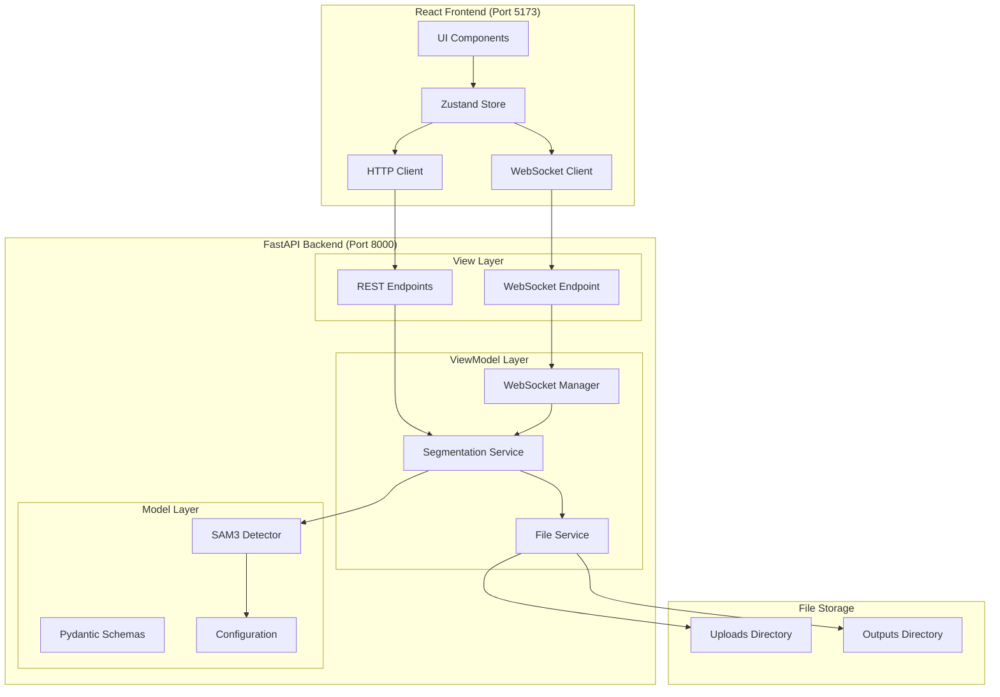
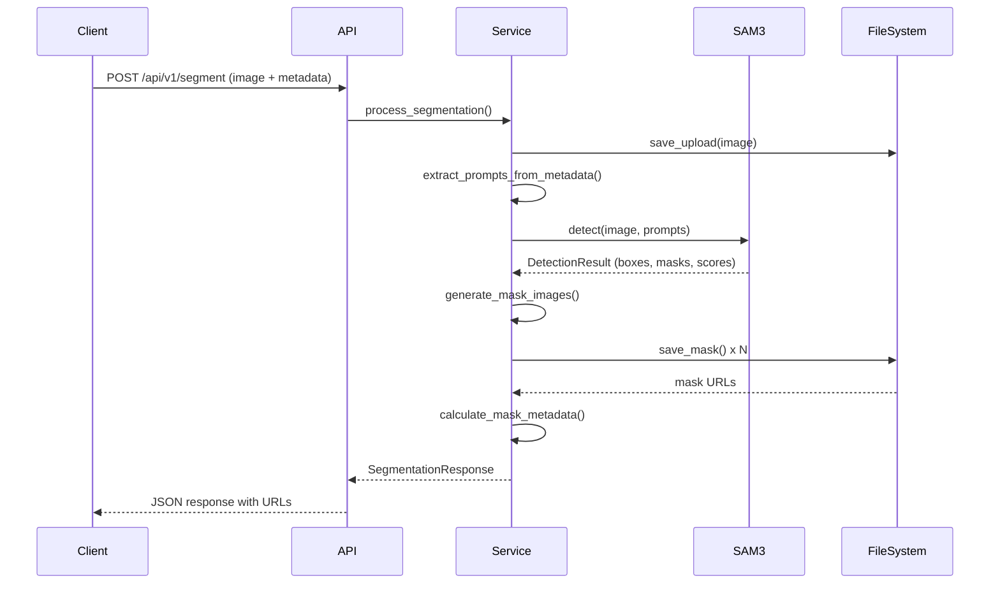
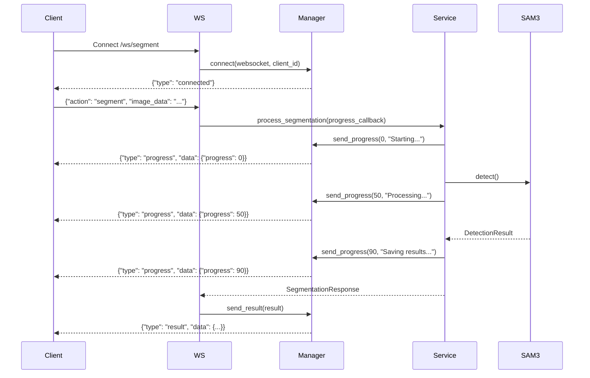

# Design Document

## Overview

The SAM3 Segmentation Service is a FastAPI-based backend application that provides real-time image segmentation capabilities using the Segment Anything Model 3 (SAM3). The system follows MVVM (Model-View-ViewModel) architecture to ensure clean separation of concerns, maintainability, and testability. The service accepts images and optional JSON metadata, processes them through SAM3 to generate segmentation masks, and delivers results to a React frontend for interactive visualization.

The architecture supports both REST API and WebSocket communication patterns, enabling synchronous request-response flows and real-time streaming updates. The system integrates with an existing React frontend that uses Zustand for state management and provides an interactive image viewer with mask overlay capabilities.

## Architecture

### High-Level Architecture



### MVVM Layer Responsibilities

**Model Layer** (`app/models/`)
- Pydantic schemas for request/response validation
- SAM3 detector wrapper and configuration
- Data structures for detection results
- Business logic for image processing

**ViewModel Layer** (`app/services/`)
- Orchestrates SAM3 model operations
- Transforms data between Model and View layers
- Manages file I/O operations
- Handles WebSocket connection lifecycle
- Implements business workflows

**View Layer** (`app/api/`)
- FastAPI routers and endpoints
- Request/response handling
- WebSocket connection management
- CORS and middleware configuration
- Input validation and error responses

## Components and Interfaces

### 1. Model Layer Components

#### SAM3 Detector (`app/models/sam3_model.py`)

```python
class SAM3Model:
    """Wrapper for SAM3 processor with lifecycle management."""
    
    def __init__(self, device: str, confidence_threshold: float):
        self.processor: Sam3Processor = None
        self.device = device
        self.confidence_threshold = confidence_threshold
        self.is_loaded = False
    
    async def load(self) -> None:
        """Load SAM3 model asynchronously during startup."""
        
    def detect(self, image: Image.Image, prompts: List[str]) -> DetectionResult:
        """Run detection on image with text prompts."""
        
    def get_health_status(self) -> Dict[str, Any]:
        """Return model health and readiness information."""
```

#### Pydantic Schemas (`app/models/schemas.py`)

```python
class SegmentationRequest(BaseModel):
    """Request schema for segmentation endpoint."""
    image: UploadFile
    metadata: Optional[UploadFile] = None
    prompts: Optional[List[str]] = None

class BoundingBox(BaseModel):
    """Bounding box in XYXY format."""
    x1: float
    y1: float
    x2: float
    y2: float
    
class MaskMetadata(BaseModel):
    """Metadata for a single segmentation mask."""
    mask_id: str
    label: str
    confidence: float
    bounding_box: BoundingBox
    area_pixels: int
    area_percentage: float
    centroid: Tuple[int, int]
    mask_url: str

class SegmentationResponse(BaseModel):
    """Response schema for segmentation results."""
    result_id: str
    original_image_url: str
    masks: List[MaskMetadata]
    processing_time_ms: float
    timestamp: datetime

class WebSocketMessage(BaseModel):
    """WebSocket message schema."""
    type: Literal["progress", "result", "error", "connected"]
    data: Dict[str, Any]
    timestamp: datetime
```

### 2. ViewModel Layer Components

#### Segmentation Service (`app/services/segmentation_service.py`)

```python
class SegmentationService:
    """Orchestrates segmentation workflow."""
    
    def __init__(
        self,
        sam3_model: SAM3Model,
        file_service: FileService,
        config: AppConfig
    ):
        self.sam3_model = sam3_model
        self.file_service = file_service
        self.config = config
    
    async def process_segmentation(
        self,
        image_file: UploadFile,
        metadata_file: Optional[UploadFile],
        prompts: Optional[List[str]],
        progress_callback: Optional[Callable[[int], None]] = None
    ) -> SegmentationResponse:
        """
        Main segmentation workflow:
        1. Save uploaded image
        2. Parse metadata and extract prompts
        3. Run SAM3 detection
        4. Generate and save mask images
        5. Create response with URLs
        """
        
    def _extract_prompts_from_metadata(
        self,
        metadata: Dict[str, Any]
    ) -> List[str]:
        """Extract object descriptions from JSON metadata."""
        
    def _generate_mask_images(
        self,
        detection_result: DetectionResult,
        original_image: Image.Image,
        result_id: str
    ) -> List[str]:
        """Convert mask tensors to PNG files and return URLs."""
        
    def _calculate_mask_metadata(
        self,
        detection_result: DetectionResult,
        mask_urls: List[str]
    ) -> List[MaskMetadata]:
        """Calculate centroids, areas, and other mask metadata."""
```

#### File Service (`app/services/file_service.py`)

```python
class FileService:
    """Manages file storage and retrieval."""
    
    def __init__(self, uploads_dir: Path, outputs_dir: Path):
        self.uploads_dir = uploads_dir
        self.outputs_dir = outputs_dir
    
    async def save_upload(
        self,
        file: UploadFile,
        result_id: str
    ) -> Path:
        """Save uploaded file with unique identifier."""
        
    async def save_mask(
        self,
        mask_array: np.ndarray,
        result_id: str,
        mask_index: int
    ) -> str:
        """Save mask as PNG and return URL."""
        
    def get_result_path(self, result_id: str, filename: str) -> Path:
        """Get path for result file."""
        
    async def cleanup_old_results(self, max_age_hours: int = 24) -> int:
        """Delete result files older than specified age."""
```

#### WebSocket Manager (`app/services/websocket_manager.py`)

```python
class WebSocketManager:
    """Manages WebSocket connections and message broadcasting."""
    
    def __init__(self):
        self.active_connections: Dict[str, WebSocket] = {}
        self.connection_tasks: Dict[str, asyncio.Task] = {}
    
    async def connect(self, websocket: WebSocket, client_id: str) -> None:
        """Accept and register WebSocket connection."""
        
    async def disconnect(self, client_id: str) -> None:
        """Remove WebSocket connection and cancel tasks."""
        
    async def send_progress(
        self,
        client_id: str,
        progress: int,
        message: str
    ) -> None:
        """Send progress update to client."""
        
    async def send_result(
        self,
        client_id: str,
        result: SegmentationResponse
    ) -> None:
        """Send segmentation result to client."""
        
    async def send_error(
        self,
        client_id: str,
        error: str
    ) -> None:
        """Send error message to client."""
```

### 3. View Layer Components

#### REST API Router (`app/api/routes/segmentation.py`)

```python
router = APIRouter(prefix="/api/v1", tags=["segmentation"])

@router.post("/segment", response_model=SegmentationResponse)
async def segment_image(
    image: UploadFile = File(...),
    metadata: Optional[UploadFile] = File(None),
    prompts: Optional[str] = Form(None),
    segmentation_service: SegmentationService = Depends(get_segmentation_service)
) -> SegmentationResponse:
    """
    Segment an image using SAM3 model.
    
    - **image**: Image file (PNG, JPG, JPEG)
    - **metadata**: Optional JSON file with object descriptions
    - **prompts**: Optional comma-separated text prompts
    """

@router.get("/results/{result_id}", response_model=SegmentationResponse)
async def get_result(
    result_id: str,
    segmentation_service: SegmentationService = Depends(get_segmentation_service)
) -> SegmentationResponse:
    """Retrieve previously processed segmentation result."""

@router.get("/health")
async def health_check(
    sam3_model: SAM3Model = Depends(get_sam3_model)
) -> Dict[str, Any]:
    """Check service and model health status."""
```

#### WebSocket Router (`app/api/routes/websocket.py`)

```python
router = APIRouter(tags=["websocket"])

@router.websocket("/ws/segment")
async def websocket_segment(
    websocket: WebSocket,
    ws_manager: WebSocketManager = Depends(get_ws_manager),
    segmentation_service: SegmentationService = Depends(get_segmentation_service)
) -> None:
    """
    WebSocket endpoint for real-time segmentation.
    
    Message format:
    - Client sends: {"action": "segment", "image_data": "base64...", "prompts": [...]}
    - Server sends: {"type": "progress", "data": {"progress": 50, "message": "..."}}
    - Server sends: {"type": "result", "data": {...}}
    """
```

#### Application Factory (`app/main.py`)

```python
def create_app() -> FastAPI:
    """Create and configure FastAPI application."""
    
    app = FastAPI(
        title="SAM3 Segmentation Service",
        version="1.0.0",
        description="Image segmentation service using SAM3"
    )
    
    # Configure CORS
    app.add_middleware(
        CORSMiddleware,
        allow_origins=settings.CORS_ORIGINS,
        allow_credentials=True,
        allow_methods=["*"],
        allow_headers=["*"],
    )
    
    # Add routers
    app.include_router(segmentation.router)
    app.include_router(websocket.router)
    
    # Startup event: Load SAM3 model
    @app.on_event("startup")
    async def startup_event():
        await sam3_model.load()
        asyncio.create_task(cleanup_task())
    
    # Serve static files
    app.mount("/outputs", StaticFiles(directory="outputs"), name="outputs")
    
    return app
```

## Data Models

### Detection Result Flow



### WebSocket Communication Flow



### File Storage Structure

```
backend/
├── uploads/
│   └── {result_id}/
│       ├── original.png
│       └── metadata.json
└── outputs/
    └── {result_id}/
        ├── original.png (copy for serving)
        ├── mask_0.png
        ├── mask_1.png
        └── mask_N.png
```

## Error Handling

### Error Response Schema

```python
class ErrorResponse(BaseModel):
    """Standard error response."""
    error: str
    detail: str
    request_id: str
    timestamp: datetime
```

### Error Handling Strategy

1. **Validation Errors (400)**
   - Invalid image format
   - File size exceeds limit
   - Malformed JSON metadata
   - Return descriptive error with field information

2. **Processing Errors (500)**
   - SAM3 model failure
   - Out of memory
   - File I/O errors
   - Log full stack trace with request context
   - Return generic error to client with request ID

3. **Not Found Errors (404)**
   - Result ID not found
   - File not found
   - Return clear message about missing resource

4. **Service Unavailable (503)**
   - Model not loaded
   - System overload
   - Return retry-after header

### WebSocket Error Handling

```python
try:
    # Process segmentation
    result = await service.process_segmentation(...)
    await manager.send_result(client_id, result)
except ValidationError as e:
    await manager.send_error(client_id, f"Validation error: {str(e)}")
except Exception as e:
    logger.exception(f"Segmentation failed for client {client_id}")
    await manager.send_error(client_id, "Processing failed")
finally:
    await manager.disconnect(client_id)
```

## Testing Strategy

### Unit Tests

**Model Layer Tests** (`tests/models/`)
- SAM3Model initialization and loading
- Detection result parsing
- Schema validation with valid/invalid data
- Configuration loading

**ViewModel Layer Tests** (`tests/services/`)
- SegmentationService workflow with mocked SAM3
- Prompt extraction from various metadata formats
- Mask image generation
- FileService operations
- WebSocketManager connection lifecycle

**View Layer Tests** (`tests/api/`)
- Endpoint request/response validation
- Error handling for invalid inputs
- CORS headers verification
- WebSocket message handling

### Integration Tests

**End-to-End Segmentation** (`tests/integration/`)
- Upload image and metadata
- Verify segmentation response structure
- Check generated files exist
- Validate mask URLs are accessible

**WebSocket Integration** (`tests/integration/`)
- Connect to WebSocket
- Send segmentation request
- Receive progress updates
- Verify final result

### Test Fixtures

```python
@pytest.fixture
def sample_image() -> Image.Image:
    """Create test image."""
    return Image.new('RGB', (640, 480), color='red')

@pytest.fixture
def sample_metadata() -> Dict[str, Any]:
    """Load sample metadata from examples."""
    with open('examples/01.json') as f:
        return json.load(f)

@pytest.fixture
def mock_sam3_model() -> Mock:
    """Mock SAM3 model for testing."""
    mock = Mock(spec=SAM3Model)
    mock.detect.return_value = DetectionResult(...)
    return mock
```

## Frontend Integration

### Zustand Store for Segmentation

```typescript
interface SegmentationState {
  results: SegmentationResponse | null;
  selectedMaskId: string | null;
  isProcessing: boolean;
  progress: number;
  error: string | null;
  
  uploadImage: (file: File, metadata?: File) => Promise<void>;
  selectMask: (maskId: string) => void;
  clearResults: () => void;
}

export const useSegmentationStore = create<SegmentationState>((set, get) => ({
  results: null,
  selectedMaskId: null,
  isProcessing: false,
  progress: 0,
  error: null,
  
  uploadImage: async (file: File, metadata?: File) => {
    set({ isProcessing: true, progress: 0, error: null });
    
    const formData = new FormData();
    formData.append('image', file);
    if (metadata) formData.append('metadata', metadata);
    
    try {
      const response = await fetch('http://localhost:8000/api/v1/segment', {
        method: 'POST',
        body: formData,
      });
      
      if (!response.ok) throw new Error('Segmentation failed');
      
      const results = await response.json();
      set({ results, isProcessing: false, progress: 100 });
    } catch (error) {
      set({ error: error.message, isProcessing: false });
    }
  },
  
  selectMask: (maskId: string) => set({ selectedMaskId: maskId }),
  clearResults: () => set({ results: null, selectedMaskId: null }),
}));
```

### WebSocket Hook

```typescript
export const useSegmentationWebSocket = () => {
  const [ws, setWs] = useState<WebSocket | null>(null);
  const updateProgress = useSegmentationStore(state => state.updateProgress);
  const setResults = useSegmentationStore(state => state.setResults);
  
  useEffect(() => {
    const websocket = new WebSocket('ws://localhost:8000/ws/segment');
    
    websocket.onmessage = (event) => {
      const message = JSON.parse(event.data);
      
      switch (message.type) {
        case 'progress':
          updateProgress(message.data.progress);
          break;
        case 'result':
          setResults(message.data);
          break;
        case 'error':
          console.error('Segmentation error:', message.data);
          break;
      }
    };
    
    setWs(websocket);
    return () => websocket.close();
  }, []);
  
  const sendSegmentationRequest = (imageData: string, prompts: string[]) => {
    if (ws && ws.readyState === WebSocket.OPEN) {
      ws.send(JSON.stringify({
        action: 'segment',
        image_data: imageData,
        prompts,
      }));
    }
  };
  
  return { sendSegmentationRequest };
};
```

### Interactive Mask Viewer Component

```typescript
interface MaskViewerProps {
  originalImageUrl: string;
  masks: MaskMetadata[];
  onMaskHover: (maskId: string | null) => void;
  onMaskClick: (maskId: string) => void;
}

export const MaskViewer: React.FC<MaskViewerProps> = ({
  originalImageUrl,
  masks,
  onMaskHover,
  onMaskClick,
}) => {
  const [hoveredMask, setHoveredMask] = useState<string | null>(null);
  
  return (
    <div className="relative">
      
      
      {masks.map((mask) => (
        <div
          key={mask.mask_id}
          className="absolute"
          style={{
            left: mask.bounding_box.x1,
            top: mask.bounding_box.y1,
            width: mask.bounding_box.x2 - mask.bounding_box.x1,
            height: mask.bounding_box.y2 - mask.bounding_box.y1,
          }}
          onMouseEnter={() => {
            setHoveredMask(mask.mask_id);
            onMaskHover(mask.mask_id);
          }}
          onMouseLeave={() => {
            setHoveredMask(null);
            onMaskHover(null);
          }}
          onClick={() => onMaskClick(mask.mask_id)}
        >
          {hoveredMask === mask.mask_id && (
            <div className="tooltip">
              <p>{mask.label}</p>
              <p>Confidence: {(mask.confidence * 100).toFixed(1)}%</p>
            </div>
          )}
          
          
        </div>
      ))}
    </div>
  );
};
```

## Configuration

### Environment Variables

```python
class Settings(BaseSettings):
    """Application configuration."""
    
    # Server
    HOST: str = "0.0.0.0"
    PORT: int = 8000
    
    # CORS
    CORS_ORIGINS: List[str] = ["http://localhost:5173"]
    
    # Model
    DEVICE: str = "cuda"  # or "cpu"
    CONFIDENCE_THRESHOLD: float = 0.5
    BOX_THRESHOLD: float = 0.15
    TEXT_THRESHOLD: float = 0.22
    IOU_THRESHOLD: float = 0.45
    
    # Storage
    UPLOADS_DIR: Path = Path("uploads")
    OUTPUTS_DIR: Path = Path("outputs")
    MAX_FILE_SIZE_MB: int = 10
    CLEANUP_AGE_HOURS: int = 24
    
    # Logging
    LOG_LEVEL: str = "INFO"
    LOG_FORMAT: str = "json"  # or "text"
    
    class Config:
        env_file = ".env"
```

### Example .env File

```bash
# Server Configuration
HOST=0.0.0.0
PORT=8000

# CORS
CORS_ORIGINS=http://localhost:5173,http://localhost:3000

# Model Configuration
DEVICE=cuda
CONFIDENCE_THRESHOLD=0.5

# Storage
MAX_FILE_SIZE_MB=10
CLEANUP_AGE_HOURS=24

# Logging
LOG_LEVEL=INFO
LOG_FORMAT=json
```

## Deployment Considerations

### Docker Support

```dockerfile
FROM python:3.11-slim

WORKDIR /app

# Install system dependencies
RUN apt-get update && apt-get install -y \
    libgl1-mesa-glx \
    libglib2.0-0 \
    && rm -rf /var/lib/apt/lists/*

# Install Python dependencies
COPY pyproject.toml uv.lock ./
RUN pip install uv && uv sync

# Copy application
COPY app/ ./app/
COPY thirdparty/ ./thirdparty/

# Create directories
RUN mkdir -p uploads outputs

EXPOSE 8000

CMD ["uv", "run", "uvicorn", "app.main:app", "--host", "0.0.0.0", "--port", "8000"]
```

### Performance Optimization

1. **Model Loading**: Load SAM3 once at startup, keep in memory
2. **Async I/O**: Use async file operations for uploads/downloads
3. **Connection Pooling**: Reuse WebSocket connections
4. **Caching**: Cache processed results for duplicate requests
5. **Batch Processing**: Support multiple images in single request
6. **GPU Optimization**: Use CUDA streams for parallel processing

### Monitoring and Metrics

```python
@router.get("/metrics")
async def get_metrics() -> Dict[str, Any]:
    """Expose service metrics."""
    return {
        "requests_total": metrics.request_count,
        "requests_success": metrics.success_count,
        "requests_failed": metrics.error_count,
        "avg_processing_time_ms": metrics.avg_processing_time,
        "active_websocket_connections": len(ws_manager.active_connections),
        "model_loaded": sam3_model.is_loaded,
        "device": sam3_model.device,
    }
```
