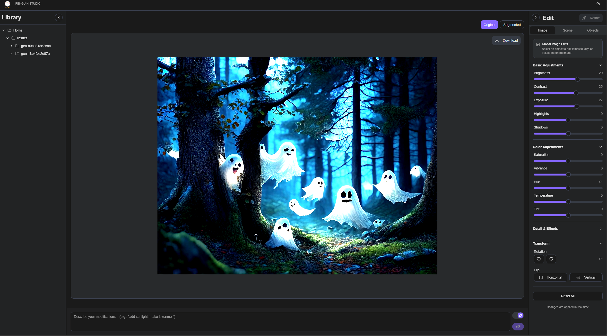

# Penguin Studio

Penguin Studio is an image generation and editing platform that combines text-to-image synthesis with automatic object detection and semantic scene configuration. It reduces the need for repeated prompting, removes the overhead of managing multiple generation paths, and enables direct editing of both the full scene and individual objects for HDR-quality results. The platform uses the Bria FIBO model with structured prompts, supports seed-consistent refinement, and provides automatic object detection and segmentation for layered object editing. Users can adjust lighting, camera angles, and scene aesthetics through graphical, semantic controls.

My design rationales, methodology, system implementations (on chat interfaces, generative AI and user interactions for image generations) are documented in this [doc](./docs/design.md).

<p style="text-align: center; width: 80%">
  
</p>

## Installation

### Prerequisites

- Python 3.11+
- Node.js 18+
- CUDA-capable GPU (above 8GB VRAM recommended)
- Bria API key
- HuggingFace account
- Granted access to sam3 at [huggingface](https://huggingface.co/facebook/sam3)

The system was developed and tested on Windows 11 with RTX 3070 with 8GB VRAM. The setup had been verified on WSL (Ubuntu 24.04).

### Clone Repository

```bash
git clone --recurse-submodules https://github.com/Constannnnnt/penguin-studio.git
cd penguin-studio
```

If already cloned without submodules:

```bash
git submodule update --init --recursive
```

### Install Package Managers

Install uv for Python dependency management:

```bash
# Windows (PowerShell)
powershell -ExecutionPolicy ByPass -c "irm https://astral.sh/uv/install.ps1 | iex"

# macOS/Linux
curl -LsSf https://astral.sh/uv/install.sh | sh
```

Install pnpm for Node.js dependency management:

```bash
npm install -g pnpm
```

### Backend Setup

```bash
cd Penguin-Studio
# Install Python dependencies
pushd backend
uv venv

# Activate the virtual environment
# Windows
.\.venv\Scripts\activate.ps1

# Linux/Mac
source .venv/bin/activate

uv sync
popd

# Install SAM3 model
pushd thirdparty/sam3
uv pip install -e .
popd

pushd backend

# Configure environment
cp .env.example .env
# Edit .env and set BRIA_API_KEY

# install the spaCy models
uv pip install https://github.com/explosion/spacy-models/releases/download/en_core_web_sm-3.8.0/en_core_web_sm-3.8.0.tar.gz
# Optional: huggingface setup, if needed, the token permission can be set to READ
hf auth login
# Request SAM3 access

# Download SAM3 checkpoint (first run only)
uv run python -m app.setup_model

popd
```

### Frontend Setup

```bash
pushd frontend/penguin

# Install dependencies
pnpm install

# Configure environment
cp .env.example .env.development
# Verify VITE_API_BASE_URL=http://localhost:8000

```

## Getting Started

### Basic Usage

Create your own [BRIA](https://bria.ai) `BRIA_API_KEY` and paste it in a new `.env` file in the `backend` folder.

```bash
# open one terminal, start the backend
pushd backend
uv run python run.py

# open another terminal, start the frontend
pushd frontend
pnpm dev
```

### Features and System Design

A quick demo video can be found on [youtube](https://youtu.be/7kMxRzNmQ48), which demonstrates the interactions and workflow for image generation and refinement in this system. A detailed description of features and system designs are documented in this [doc](./docs/system-design.md).

Interactive API docs available at:

- Swagger UI: `http://localhost:8000/docs`
- ReDoc: `http://localhost:8000/redoc`

## License

Licensed under the Apache License, Version 2.0. You may obtain a copy of the License at:

http://www.apache.org/licenses/LICENSE-2.0

Unless required by applicable law or agreed to in writing, software distributed under the License is distributed on an "AS IS" BASIS, WITHOUT WARRANTIES OR CONDITIONS OF ANY KIND, either express or implied. See the License for the specific language governing permissions and limitations under the License.

### Third-Party Components

This project includes [SAM3](https://github.com/facebookresearch/sam3) (SAM 3: Segment Anything with Concepts) as a git submodule, licensed under SAM License.
